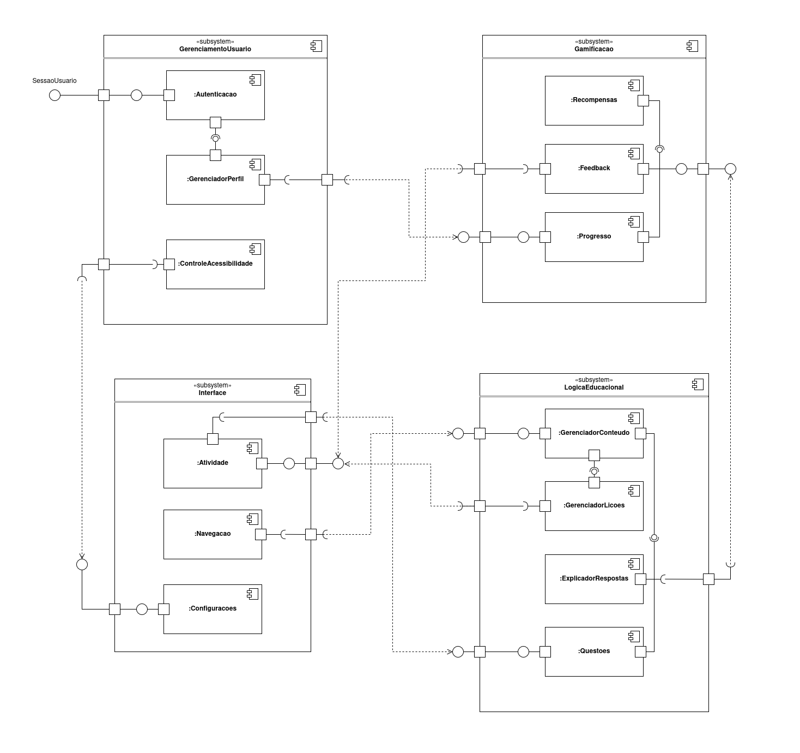

# 2.1. Módulo Notação UML – Modelagem Estática

## Diagrama de Componentes
O diagrama de componente tem como objetivo mostrar a estrutura do sistema de software, que descreve os componentes do software, suas interfaces e dependências. O uso do diagrama de componentes pode ser útil para modelar sistemas de software em um alto nível. 

Para a confecção do diagrama de componentes do BrinCalango, os integrantes decidiram seguir uma abordagem de visão ampla, onde foram definidos os subsistemas, componentes e depois suas relações. Para isso foram definidos 4 subsistemas: 
- Gerenciamento de usuário: onde foram especificados componentes relacionados ao usuário como autenticação e controle de acessibilidade;
- Gamificação: para esse subsistema foram definidos componentes relacionados a como a gamificação funcionará no BrinCalango, como o progresso do usuário e sistema de recompensas;
- Interface: esse subsistema consistem em agrupar componentes que dizem respeito a interface visual do BrinCalango, nele é possível observar o componente de atividade que define a interface das atividades na aplicação;
- Lógica educacional: por fim, o subsistema de lógica educacional é composto por componentes que compõe o funcionamento das lições do BrinCalango, nele é possível obervar o componente de gerenciador de lições, por exemplo, que organiza as lições de forma sequencial e o componente de questões que administra as questões utilizadas nas lições.

Após isso foram realizadas as ligações de relação entre os componentes e subsistemas. Para isso foram definidas diversas relações de dependência, como pode ser observado no diagrama.

### Diagrama de Componentes
#### Link
<iframe 
  src="https://viewer.diagrams.net/?tags=%7B%7D&lightbox=1&target=blank&highlight=000000&edit=_blank&layers=1&nav=1&title=diagrama-componentes.drawio&dark=0#Uhttps%3A%2F%2Fdrive.google.com%2Fuc%3Fid%3D1YRTtqmqos4X-r8P1zL3fBTePucUJM21E%26export%3Ddownload" 
  width="100%" 
  height="600px" 
  frameborder="0">
</iframe>

#### Imagem

## Histórico de Versão

| Versão | Data       | Descrição                            | Autor                                                 | Revisor                                               |
| :----: | ---------- | ------------------------------------ | ----------------------------------------------------- | ----------------------------------------------------- |
| `1.0`  | 07/05/2025 | Criação da documentação e adição do diagrama de componentes       | [André Maia](https://github.com/andre-maia51) [Júlia Takaki](https://github.com/juliatakaki) | |

## Referências
Component Diagrams - UML Diagrams. Disponível em: <https://www.uml-diagrams.org/component-diagrams.html>.  
Component diagrams - IBM Documentation. Disponível em: <https://www.ibm.com/docs/pt-br/rsas/7.5.0?topic=services-component-diagrams>.  