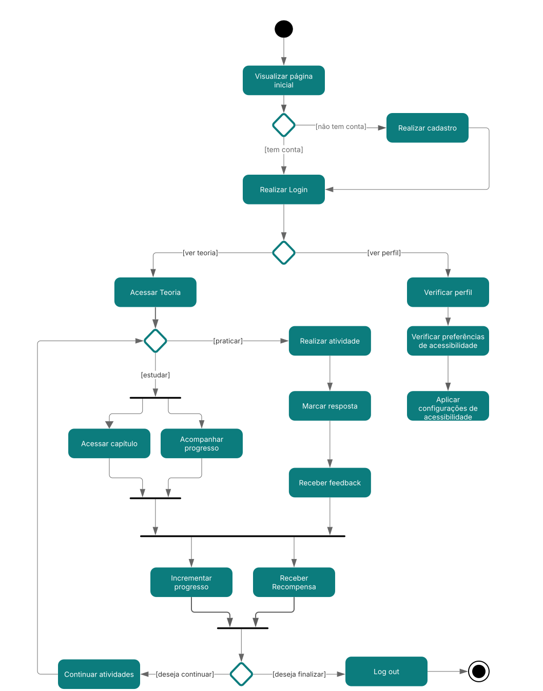

# 2.2. Módulo Notação UML – Modelagem Dinâmica

A modelagem dinâmica na UML (Unified Modeling Language) tem como objetivo representar o **comportamento do sistema ao longo do tempo**, especialmente em resposta a eventos, ações do usuário ou interações internas entre objetos.

Segundo Booch, Rumbaugh e Jacobson (OMG, 2017), a modelagem dinâmica é composta por **diagramas comportamentais**, sendo os trabalhados nessa entrega:
- Diagrama de Atividades
- Diagrama de Sequência
- Diagrama de Comunicação/Colaboração
- Diagrama de Estados

Esses modelos fornecem uma visão essencial para projetar fluxos de uso, automações e ciclos de interação com o usuário. No caso do BrinCalango, o diagrama mais representativo é o **Diagrama de Atividades**, por tratar-se de um sistema educacional com fluxos alternativos e caminhos condicionais baseados na ação do jogador.

## Diagrama de Atividades

O **Diagrama de Atividades** é um dos principais diagramas da UML para modelagem dinâmica. Ele descreve **fluxos de controle e de dados**, ilustrando o comportamento de processos internos, ações do usuário, decisões, repetições e paralelismos.

Componentes principais (Slides da Professoraa Milene Serrano):
- **Ações**: atividades executadas (ex: “Realizar Login”)
- **Nós de decisão**: bifurcações condicionais (`[tem conta]`, `[deseja continuar]`)
- **Nós de bifurcação/unificação**: ações simultâneas ou que convergem
- **Nós de início/finalização**: estados inicial e final do processo
- **Fluxos de controle**: setas direcionando o andamento

#### [Link](https://lucid.app/lucidchart/44cbd78d-e6aa-49a7-9128-7459e512cf4c/edit?beaconFlowId=DCBC4E304E795FB1&invitationId=inv_0b87a48e-93d8-44a6-b635-ef6ef2aad40d&page=0_0#)
<iframe 
  src="https://lucid.app/lucidchart/44cbd78d-e6aa-49a7-9128-7459e512cf4c/edit?beaconFlowId=DCBC4E304E795FB1&invitationId=inv_0b87a48e-93d8-44a6-b635-ef6ef2aad40d&page=0_0#" 
  width="100%" 
  height="600px" 
  frameborder="0">
</iframe>

###  Autoras
- Ana Júlia Mendes Santos  
- Júlia Rocha Fortunato  
- Maria Clara Oleari de Araújo 

#### Imagem

O diagrama elaborado representa de forma precisa o **fluxo completo de interação do jogador com a plataforma BrinCalango**. A seguir, destacamos as principais etapas modeladas:

1. **Visualizar Página Inicial e Login**

    O diagrama começa corretamente com um **nó de início** (círculo preto). Em seguida, há uma **decisão condicional** ('[tem conta]' / '[não tem conta]') que define o primeiro comportamento do usuário:

    - Se **não tiver conta**, segue para 'Realizar cadastro'
    - Caso contrário, prossegue com 'Realizar Login'

2. **Ver Perfil e Acessibilidade (opcional)** 

    Após o login, o jogador pode optar por:
    - Acessar 'Ver perfil' → o que leva à verificação/aplicação de 'Configurações de Acessibilidade'
    - Acessar diretamente o conteúdo ('Acessar Teoria')

3. **Fluxo entre Teoria e Prática** 

    Após 'Acessar Teoria', o usuário pode:
    - Escolher '[estudar]' → e acessar o capítulo ou acompanhar o progresso
    - Escolher '[praticar]' → e iniciar o ciclo de resolução de atividades

    Essa divisão é muito bem representada por um **nó de decisão**, mantendo o fluxo claro e lógico. A presença de **ações paralelas** como 'Acessar capítulo' e 'Acompanhar progresso' demonstra conhecimento de **nós de bifurcação e união**.

4. **Execução da Atividade**

    O caminho prático inclui:
    - 'Realizar atividade'
    - 'Marcar resposta'
    - 'Receber feedback'

    Após o feedback, o diagrama apresenta um **ponto de junção** onde ocorre:
    - 'Incrementar progresso'
    - 'Receber recompensa'  
    Essas ações são paralelas, demonstrando que o sistema pode executar ambas simultaneamente, alinhando-se à gamificação proposta pelo sistema.

5. **Decisão Final e Loop de Retorno**

    Por fim, o diagrama inclui um **nó de decisão lógico** onde o jogador escolhe:
    - '[deseja continuar]' → retorna ao fluxo (ciclo de aprendizado)
    - '[deseja finalizar]' → termina com 'Log out' e **nó de encerramento** (círculo duplo)

## 📜 Histórico de Versão

| Versão | Data       | Descrição                                    | Autor(es)                                                                                              | Revisor(es)                                      | Descrição da Revisão                                                                                  | Commits |
| :----: | ---------- | -------------------------------------------- | -------------------------------------------------------------------------------------------------------- | ------------------------------------------------ | ------------------------------------------------------------------------------------------------------ | -------- |
| 1.0    | 08/05/2025 | Documentação da Modelagem Estática + Diagrama de Atividades | [Ana Júlia](https://github.com/ailujana), [Júlia Fortunato](https://github.com/julia-fortunato), [Maria Clara](https://github.com/Oleari19) | -                                                |  -  | [Commit]() |

### **Referência:** 
OMG Unified Modeling Language (UML) Version 2.5.1 – Superstructure

[uml-diagrams.org](https://www.uml-diagrams.org/activity-diagrams.html)

[Slides da Profa. Milene Serrano – Diagrama de Atividades UML](https://aprender3.unb.br/pluginfile.php/3070938/mod_page/content/1/Arquitetura%20e%20Desenho%20de%20Software%20-%20Aula%20Modelagem%20UML%20Din%C3%A2mica%20-%20Profa.%20Milene.pdf)
