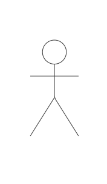
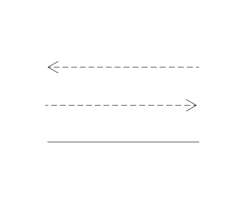
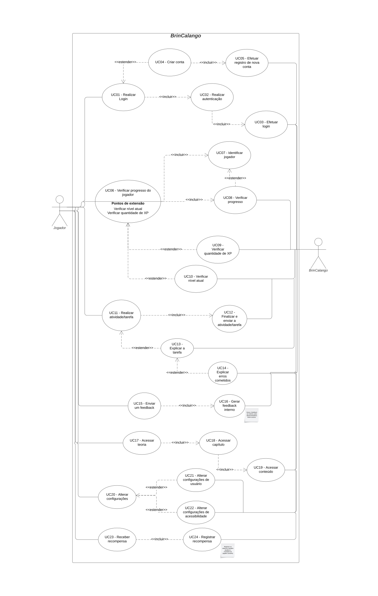

# 2.3. Módulo Notação UML – Modelagem Organizacional e Casos de Uso

## Diagrama de Casos de Uso 

### 
Introdução 
 

 Os casos de uso, também conhecidos dentro da notação UML como diagramas comportamentais, são uma importante ferramenta a medida que ajudam a entender as ações que um sistema/subsistema deve desempenhar em conjunto com agentes externos que geralmente são chamados de atores.
 Essa representação mostra de maneira simplificada como ocorrem as interações e quais são caminhos que os atores percorrem afim de atingir seus objetivos no sistema e são normalmente utilizados para demonstrar os requisitos funcionais deste.[1]
 

### Metodologia

 Para ser realizada a montagem do diagrama dos casos de uso para a aplicação BrinCalango optou-se pela análise da lógia de uso da aplicação para se ter uma melhor compreensão das tarefas que o usuário pode realizar dentro do sistema. No que se refere ao diagrama, foram definidos e inseridos os atores que participam assim como outros elementos ilustrativos para demonstrar o funcionamento e fluxo das funcionalidades dentro do BrinCalango. Para a produção do diagrama dos casos de uso foi utilizada a ferramenta <b><a href="https://www.lucidchart.com/pages/pt">Lucidchart</a> 
  </b> [2], é possível observar a simbologia utilizada e seus significados a partir da Tabela 1. 

<b>Tabela 1</b>- Simbologia utilizada no Diagrama dos casos de uso

<table>
<thead>
<tr>
<th>Nome</th>
<th>Função</th>
<th style="text-align: center;">Elemento</th>
</tr>
</thead>
<tbody>
<tr>
<td>Atores do Sistema</td>
<td>Servem como uma representação dos atores que participam de alguma forma do sistema, podem ser desde usuários até componentes e subsistemas.</td>
<td style="text-align: center;">
  <figure class="usecaseElement" style="width: 50%; margin: 0 auto; display: flex; justify-content: center;">
    
  </figure>
</td>
</tr>
<tr>
<td>Elipse (Caso de Uso)</td>
<td>Símbolo usado dentro do diagrama para representar efetivamente os casos de uso. O caso de uso se trata de uma determinada ação e/ou também funcionalidade que o sistema executará de acordo com as decisões dos atores, esse elemento (Elipse) possui em si o nome do caso de uso específico. </td>
<td style="text-align: center;">
  <figure class="usecaseElement" style="width: 50%; margin: 0 auto; display: flex; justify-content: center;">
    
  </figure>
</td>
</tr>
<tr>
<td>Retângulo (Sistema)</td>
<td>Usado no diagrama para representar o sistema ou também o bloco em análise. Ele engloba tanto os casos de uso como também os atores relacionados.</td>
<td style="text-align: center;">
  <figure class="usecaseElement" style="width: 50%; margin: 0 auto; display: flex; justify-content: center;">
    
  </figure>
</td>
</tr>
<tr>
<td>Flecha (Relações)</td>
<td>São usadas com a finalidade de mostrar as relações ou interações que existem entre atores e os casos de uso.</td>
<td style="text-align: center;">
  <figure class="usecaseElement" style="width: 50%; margin: 0 auto; display: flex; justify-content: center;">
    
  </figure>
</td>
</tr>
</tbody>
</table>

<b>Autor: <a href="https://github.com/julia-fortunato">Júlia Fortunato, 2025</a></b>

###  Autoras
- Ana Júlia Mendes Santos  
- Júlia Rocha Fortunato  
- Maria Clara Oleari de Araújo  

### Imagem do diagrama

A imagem do diagrama pode ser encontrada na Figura 1.

<strong>Figura 1 – Diagrama de Casos de Uso da BrinCalango</strong>

  

<b>Autor: <a href="https://github.com/ailujana">Ana Júlia</a>, <a href="https://github.com/julia-fortunato">Júlia Fortunato</a>, <a href="https://github.com/Oleari19">Maria Clara</a>, 2025</b>

### Link para o diagrama no Lucidchart

[Acesse o diagrama interativo no Lucidchart.](https://lucid.app/lucidchart/e898bf49-aec3-48dd-b4c3-5370546a28f8/edit?viewport_loc=-4267%2C-649%2C10613%2C4615%2C.Q4MUjXso07N&invitationId=inv_fa8c417f-331e-4c8d-adc7-d116ba3a4369)

*Observação: talvez seja necessário fazer login no Lucidchart.*

### Especificação dos Casos de Uso

### UC01. Realizar login

**Tabela 2: Especificação do caso de uso UC01**

<table>
  <tr>
    <th style="text-align: left;">UC01</th>
    <td style="text-align: left;">Realizar login</td>
  </tr>
  <tr>
    <th style="text-align: left;">Atores</th>
    <td style="text-align: left;">Jogador</td>
  </tr>
  <tr>
    <th style="text-align: left;">Frequência de uso</th>
    <td style="text-align: left;">Alta</td>
  </tr>
  <tr>
    <th style="text-align: left;">Pré-condições</th>
    <td style="text-align: left;">
      PRE01: Estar cadastrado na plataforma. 
      PRE02: Possuir conexão com a internet.
    </td>
  </tr>
  <tr>
    <th style="text-align: left;">Fluxo básico</th>
    <td style="text-align: left;">
      FB01.
      <ol>
        <li>O jogador acessa a plataforma BrinCalango.</li>
        <li>O sistema exibe a tela de login.</li>
        <li>O jogador informa seu e-mail e senha.</li>
        <li>O sistema verifica as credenciais.</li>
        <li>O sistema permite o acesso à conta do jogador.</li>
        <li>Fim do caso de uso.</li>
      </ol>
    </td>
  </tr>
  <tr>
    <th style="text-align: left;">Fluxos alternativos</th>
    <td style="text-align: left;">
      FA01: Esqueci a senha
      <ol>
        <li>O jogador clica em "Esqueci minha senha".</li>
        <li>O sistema solicita o e-mail de recuperação.</li>
        <li>O jogador informa o e-mail.</li>
        <li>O sistema envia um link de redefinição de senha.</li>
        <li>O jogador redefine a senha e retorna ao fluxo básico.</li>
        <li>Fim do caso de uso.</li>
      </ol>
    </td>
  </tr>
  <tr>
    <th style="text-align: left;">Fluxos de exceção</th>
    <td style="text-align: left;">
      FE01: Credenciais inválidas
      <ol>
        <li>O jogador informa e-mail e/ou senha incorretos.</li>
        <li>O sistema exibe uma mensagem de erro e solicita nova tentativa.</li>
        <li>Fim do caso de uso.</li>
      </ol>
    </td>
  </tr>
  <tr>
    <th style="text-align: left;">Pós-condições</th>
    <td style="text-align: left;">POS01. O jogador está autenticado e pode acessar funcionalidades da plataforma.</td>
  </tr>
  <tr>
    <th style="text-align: left;">Data da criação</th>
    <td style="text-align: left;">08/05/2025</td>
  </tr>
</table>

**Autor:** [Júlia Fortunato](https://github.com/julia-fortunato), 2025

## Diagrama de Pacotes

## 
Referências bibliográficas

> [1] SERRANO, Milene; SERRANO, Maurício. Elicitação, Modelagem e Análise - Aula 13. s.d. Slide 8 de 40.</a>  

> [2] Lucid Software Português. Tutorial de Caso de Uso UML [Recurso eletrônico: vídeo], 2019. Disponível em: https://www.youtube.com/watch?v=ab6eDdwS3rA. Acesso em: 08 de maio de 2025.
