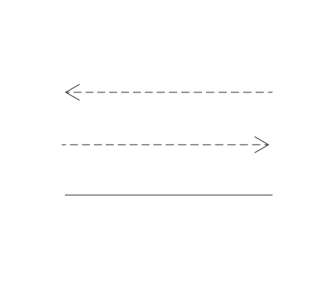
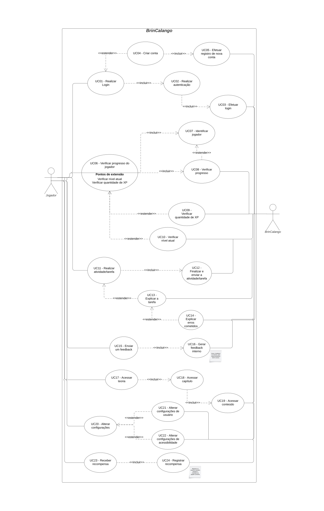
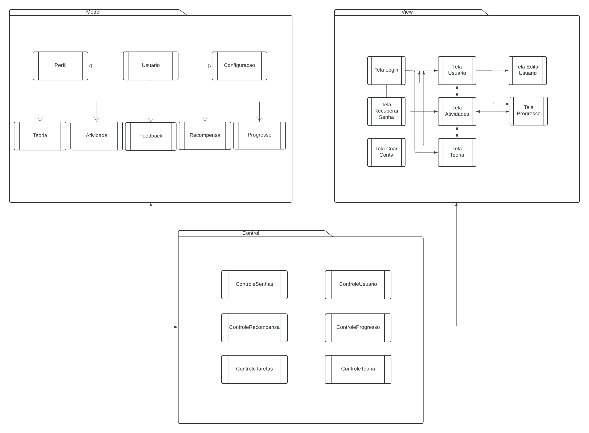

# 2.3. Módulo Notação UML – Modelagem Organizacional e Casos de Uso

A modelagem organizacional na UML (Unified Modeling Language) tem como objetivo representar as **funcionalidades do sistema (casos de uso)** e a **estrutura modular de organização lógica (pacotes)**. Ela foca em **quem utiliza o sistema**, **quais funcionalidades estão disponíveis** e **como essas funcionalidades se agrupam**.

Segundo Booch, Rumbaugh e Jacobson (OMG, 2017), a modelagem organizacional é composta por **diagramas voltados à perspectiva externa e estrutural do sistema**, sendo os principais utilizados nesta entrega:

- Diagrama de Casos de Uso  
- Diagrama de Pacotes

Esses diagramas fornecem uma base sólida para a identificação dos **requisitos funcionais** e da **estrutura geral** do sistema, permitindo alinhar expectativas entre a equipe técnica e os stakeholders, além de facilitar a validação do escopo de forma visual e compreensível.

## Diagrama de Casos de Uso 

### 
Introdução 
 

 Os casos de uso, também conhecidos dentro da notação UML como diagramas comportamentais, são uma importante ferramenta a medida que ajudam a entender as ações que um sistema/subsistema deve desempenhar em conjunto com agentes externos que geralmente são chamados de atores.
 Essa representação mostra de maneira simplificada como ocorrem as interações e quais são caminhos que os atores percorrem afim de atingir seus objetivos no sistema e são normalmente utilizados para demonstrar os requisitos funcionais deste.[1]
 

### Metodologia

 Para ser realizada a montagem do diagrama dos casos de uso para a aplicação BrinCalango optou-se pela análise da lógia de uso da aplicação para se ter uma melhor compreensão das tarefas que o usuário pode realizar dentro do sistema. No que se refere ao diagrama, foram definidos e inseridos os atores que participam assim como outros elementos ilustrativos para demonstrar o funcionamento e fluxo das funcionalidades dentro do BrinCalango. Para a produção do diagrama dos casos de uso foi utilizada a ferramenta <b><a href="https://www.lucidchart.com/pages/pt">Lucidchart</a> 
  </b> [2], é possível observar a simbologia utilizada e seus significados a partir da Tabela 1. 

<b>Tabela 1</b>: Simbologia utilizada no Diagrama dos casos de uso

<table>
<thead>
<tr>
<th>Nome</th>
<th>Função</th>
<th style="text-align: center;">Elemento</th>
</tr>
</thead>
<tbody>
<tr>
<td>Atores do Sistema</td>
<td>Servem como uma representação dos atores que participam de alguma forma do sistema, podem ser desde usuários até componentes e subsistemas.</td>
<td style="text-align: center;">
  

</td>
</tr>
<tr>
<td>Elipse (Caso de Uso)</td>
<td>Símbolo usado dentro do diagrama para representar efetivamente os casos de uso. O caso de uso se trata de uma determinada ação e/ou também funcionalidade que o sistema executará de acordo com as decisões dos atores, esse elemento (Elipse) possui em si o nome do caso de uso específico. </td>
<td style="text-align: center;">
  

</td>
</tr>
<tr>
<td>Retângulo (Sistema)</td>
<td>Usado no diagrama para representar o sistema ou também o bloco em análise. Ele engloba tanto os casos de uso como também os atores relacionados.</td>
<td style="text-align: center;">
  

</td>
</tr>
<tr>
<td>Flecha (Relações)</td>
<td>São usadas com a finalidade de mostrar as relações ou interações que existem entre atores e os casos de uso.</td>
<td style="text-align: center;">
  

</td>
</tr>
</tbody>
</table>

<b>Autor: <a href="https://github.com/julia-fortunato">Júlia Fortunato, 2025</a></b>

###  Autoras
- Ana Júlia Mendes Santos  
- Júlia Rocha Fortunato  
- Maria Clara Oleari de Araújo  

### Imagem do diagrama

A imagem do diagrama pode ser encontrada na Figura 1.

<strong>Figura 1 – Diagrama de Casos de Uso da BrinCalango</strong>

<b>Autor: <a href="https://github.com/ailujana">Ana Júlia</a>, <a href="https://github.com/julia-fortunato">Júlia Fortunato</a>, <a href="https://github.com/Oleari19">Maria Clara</a>, 2025</b>

### Link para o diagrama no Lucidchart

[Acesse o diagrama interativo no Lucidchart.](https://lucid.app/lucidchart/e898bf49-aec3-48dd-b4c3-5370546a28f8/edit?viewport_loc=-4267%2C-649%2C10613%2C4615%2C.Q4MUjXso07N&invitationId=inv_fa8c417f-331e-4c8d-adc7-d116ba3a4369)

*Observação: talvez seja necessário fazer login no Lucidchart.*

### Especificação dos Casos de Uso

### UC01. Realizar login

**Tabela 2: Especificação do caso de uso UC01**

<table>
  <tr>
    <th style="text-align: left;">UC01</th>
    <td style="text-align: left;">Realizar login</td>
  </tr>
  <tr>
    <th style="text-align: left;">Atores</th>
    <td style="text-align: left;">Jogador</td>
  </tr>
  <tr>
    <th style="text-align: left;">Frequência de uso</th>
    <td style="text-align: left;">Alta</td>
  </tr>
  <tr>
    <th style="text-align: left;">Pré-condições</th>
    <td style="text-align: left;">
      PRE01: Estar cadastrado na plataforma. 
      PRE02: Possuir conexão com a internet.
    </td>
  </tr>
  <tr>
    <th style="text-align: left;">Fluxo básico</th>
    <td style="text-align: left;">
      FB01.
      <ol>
        <li>O jogador acessa a plataforma BrinCalango.</li>
        <li>O sistema exibe a tela de login.</li>
        <li>O jogador informa seu e-mail e senha.</li>
        <li>O sistema verifica as credenciais.</li>
        <li>O sistema permite o acesso à conta do jogador.</li>
        <li>Fim do caso de uso.</li>
      </ol>
    </td>
  </tr>
  <tr>
    <th style="text-align: left;">Fluxos alternativos</th>
    <td style="text-align: left;">
      FA01: Esqueci a senha
      <ol>
        <li>O jogador clica em "Esqueci minha senha".</li>
        <li>O sistema solicita o e-mail de recuperação.</li>
        <li>O jogador informa o e-mail.</li>
        <li>O sistema envia um link de redefinição de senha.</li>
        <li>O jogador redefine a senha e retorna ao fluxo básico.</li>
        <li>Fim do caso de uso.</li>
      </ol>
    </td>
  </tr>
  <tr>
    <th style="text-align: left;">Fluxos de exceção</th>
    <td style="text-align: left;">
      FE01: Credenciais inválidas
      <ol>
        <li>O jogador informa e-mail e/ou senha incorretos.</li>
        <li>O sistema exibe uma mensagem de erro e solicita nova tentativa.</li>
        <li>Fim do caso de uso.</li>
      </ol>
    </td>
  </tr>
  <tr>
    <th style="text-align: left;">Pós-condições</th>
    <td style="text-align: left;">POS01. O jogador está autenticado e pode acessar funcionalidades da plataforma.</td>
  </tr>
  <tr>
    <th style="text-align: left;">Data da criação</th>
    <td style="text-align: left;">08/05/2025</td>
  </tr>
</table>

**Autor:** [Júlia Fortunato](https://github.com/julia-fortunato), 2025

### UC02. Realizar autenticação

**Tabela 3: Especificação do caso de uso UC02**

<table>
  <tr>
    <th style="text-align: left;">UC02</th>
    <td style="text-align: left;">Realizar autenticação</td>
  </tr>
  <tr>
    <th style="text-align: left;">Atores</th>
    <td style="text-align: left;">Jogador</td>
    <td style="text-align: left;">BrinCalango</td>
  </tr>
  <tr>
    <th style="text-align: left;">Frequência de uso</th>
    <td style="text-align: left;">Alta</td>
  </tr>
  <tr>
    <th style="text-align: left;">Pré-condições</th>
    <td style="text-align: left;">
      PRE01: Estar cadastrado na plataforma. 
      PRE02: Possuir conexão com a internet.
    </td>
  </tr>
  <tr>
    <th style="text-align: left;">Fluxo básico</th>
    <td style="text-align: left;">
      FB02.
      <ol>
        <li>O jogador acessa a tela de login.</li>
        <li>O jogador informa seu e-mail e senha.</li>
        <li>O sistema verifica as credenciais.</li>
        <li>O sistema autentica o jogador.</li>
        <li>O sistema direciona o jogador para a página inicial da plataforma.</li>
        <li>Fim do caso de uso.</li>
      </ol>
    </td>
  </tr>
  <tr>
    <th style="text-align: left;">Fluxos alternativos</th>
    <td style="text-align: left;">
      FA01: Autenticação em dois fatores
      <ol>
        <li>O sistema solicita autenticação em dois fatores.</li>
        <li>O jogador informa o código recebido.</li>
        <li>O sistema valida o código.</li>
        <li>Fluxo retorna ao passo 4 do fluxo básico.</li>
        <li>Fim do caso de uso.</li>
      </ol>
    </td>
  </tr>
  <tr>
    <th style="text-align: left;">Fluxos de exceção</th>
    <td style="text-align: left;">
      FE01: Dados inválidos
      <ol>
        <li>O jogador informa e-mail e/ou senha incorretos.</li>
        <li>O sistema informa o erro e solicita nova tentativa.</li>
        <li>Fim do caso de uso.</li>
      </ol>
    </td>
  </tr>
  <tr>
    <th style="text-align: left;">Pós-condições</th>
    <td style="text-align: left;">POS01. O jogador está autenticado na plataforma.</td>
  </tr>
  <tr>
    <th style="text-align: left;">Data da criação</th>
    <td style="text-align: left;">09/05/2025</td>
  </tr>
</table>

**Autor:** [Júlia Fortunato](https://github.com/julia-fortunato), 2025

### UC03. Efetuar login

**Tabela 4: Especificação do caso de uso UC03**

<table>
  <tr>
    <th style="text-align: left;">UC03</th>
    <td style="text-align: left;">Efetuar login</td>
  </tr>
  <tr>
    <th style="text-align: left;">Atores</th>
    <td style="text-align: left;">BrinCalango</td>
  </tr>
  <tr>
    <th style="text-align: left;">Frequência de uso</th>
    <td style="text-align: left;">Alta</td>
  </tr>
  <tr>
    <th style="text-align: left;">Pré-condições</th>
    <td style="text-align: left;">
      PRE01: O jogador deve ter informado suas credenciais. 
      PRE02: As credenciais do jogador devem ter sido autenticadas com sucesso. 
      PRE03: O sistema deve estar conectado à internet.
    </td>
  </tr>
  <tr>
    <th style="text-align: left;">Fluxo básico</th>
    <td style="text-align: left;">
      FB03.
      <ol>
        <li>O sistema recebe o e-mail e a senha do jogador.</li>
        <li>O sistema verifica se as credenciais são válidas.</li>
        <li>O sistema autentica o jogador na plataforma.</li>
        <li>O login é efetuado.</li>
        <li>Fim do caso de uso.</li>
      </ol>
    </td>
  </tr>
  <tr>
    <th style="text-align: left;">Fluxos alternativos</th>
    <td style="text-align: left;">
      FA01: Login via provedor externo
      <ol>
        <li>O sistema detecta a escolha de login via Google.</li>
        <li>O sistema redireciona para a autenticação no Google.</li>
        <li>Após sucesso, o sistema autentica o jogador.</li>
        <li>Fim do caso de uso.</li>
      </ol>
    </td>
  </tr>
  <tr>
    <th style="text-align: left;">Fluxos de exceção</th>
    <td style="text-align: left;">
      FE01: Credenciais inválidas
      <ol>
        <li>O sistema detecta que o e-mail ou a senha estão incorretos.</li>
        <li>O sistema exibe uma mensagem de erro e solicita nova tentativa.</li>
        <li>Fim do caso de uso.</li>
      </ol>
    </td>
  </tr>
  <tr>
    <th style="text-align: left;">Pós-condições</th>
    <td style="text-align: left;">POS01. O jogador está autenticado, com login realizado e pode utilizar a plataforma.</td>
  </tr>
  <tr>
    <th style="text-align: left;">Data da criação</th>
    <td style="text-align: left;">09/05/2025</td>
  </tr>
</table>

**Autor:** [Júlia Fortunato](https://github.com/julia-fortunato), 2025

### UC04. Criar conta

**Tabela 5: Especificação do caso de uso UC04**

<table>
  <tr>
    <th style="text-align: left;">UC04</th>
    <td style="text-align: left;">Criar conta</td>
  </tr>
  <tr>
    <th style="text-align: left;">Atores</th>
    <td style="text-align: left;">Jogador</td>
  </tr>
  <tr>
    <th style="text-align: left;">Frequência de uso</th>
    <td style="text-align: left;">Média</td>
  </tr>
  <tr>
    <th style="text-align: left;">Pré-condições</th>
    <td style="text-align: left;">
      PRE01: Ter acesso à plataforma BrinCalango. 
      PRE02: Possuir conexão com a internet.
    </td>
  </tr>
  <tr>
    <th style="text-align: left;">Fluxo básico</th>
    <td style="text-align: left;">
      FB04.
      <ol>
        <li>O jogador acessa a opção "Criar conta" na plataforma.</li>
        <li>O sistema exibe o formulário de cadastro.</li>
        <li>O jogador preenche os campos do forumário.</li>
        <li>O jogador confirma o cadastro.</li>
        <li>O sistema valida os dados e cria a conta.</li>
        <li>O sistema confirma a criação e redireciona para o login.</li>
        <li>Fim do caso de uso.</li>
      </ol>
    </td>
  </tr>
  <tr>
    <th style="text-align: left;">Fluxos alternativos</th>
    <td style="text-align: left;">
      FA01: Criar conta com Google
      <ol>
        <li>O jogador opta por criar conta usando o Google.</li>
        <li>O sistema redireciona para autenticação do Google.</li>
        <li>Após validação, a conta é criada automaticamente.</li>
        <li>O jogador é redirecionado para a tela inicial.</li>
        <li>Fim do caso de uso.</li>
      </ol>
    </td>
  </tr>
  <tr>
    <th style="text-align: left;">Fluxos de exceção</th>
    <td style="text-align: left;">
      FE01: E-mail já cadastrado
      <ol>
        <li>O jogador informa um e-mail já registrado.</li>
        <li>O sistema exibe uma mensagem de erro e solicita outro e-mail.</li>
        <li>Fim do caso de uso.</li>
      </ol>
    </td>
  </tr>
  <tr>
    <th style="text-align: left;">Pós-condições</th>
    <td style="text-align: left;">POS01. Conta criada com sucesso e o jogador pode realizar login.</td>
  </tr>
  <tr>
    <th style="text-align: left;">Data da criação</th>
    <td style="text-align: left;">09/05/2025</td>
  </tr>
</table>

**Autor:** [Júlia Fortunato](https://github.com/julia-fortunato), 2025

### UC05. Efetuar registro de uma nova conta

**Tabela 6: Especificação do caso de uso UC05**

<table>
  <tr>
    <th style="text-align: left;">UC05</th>
    <td style="text-align: left;">Efetuar registro de uma nova conta</td>
  </tr>
  <tr>
    <th style="text-align: left;">Atores</th>
    <td style="text-align: left;">BrinCalango</td>
  </tr>
  <tr>
    <th style="text-align: left;">Frequência de uso</th>
    <td style="text-align: left;">Alta</td>
  </tr>
  <tr>
    <th style="text-align: left;">Pré-condições</th>
    <td style="text-align: left;">
      PRE01: O jogador tenha submetido corretamente os dados no formulário de criação de conta. 
      PRE02: Conexão com o banco de dados esteja ativa.
    </td>
  </tr>
  <tr>
    <th style="text-align: left;">Fluxo básico</th>
    <td style="text-align: left;">
      FB05.
      <ol>
        <li>O sistema recebe os dados do formulário de cadastro.</li>
        <li>O sistema valida os dados recebidos.</li>
        <li>O sistema verifica se o e-mail informado já está cadastrado.</li>
        <li>O sistema criptografa a senha do usuário.</li>
        <li>O sistema armazena os dados no banco de dados.</li>
        <li>O sistema retorna uma confirmação de criação com sucesso.</li>
        <li>Fim do caso de uso.</li>
      </ol>
    </td>
  </tr>
  <tr>
    <th style="text-align: left;">Fluxos alternativos</th>
    <td style="text-align: left;">
      FA01: Registro com dados parciais
      <ol>
        <li>O sistema identifica campos obrigatórios ausentes.</li>
        <li>O sistema retorna erro solicitando preenchimento completo dos dados.</li>
        <li>Fim do caso de uso.</li>
      </ol>
    </td>
  </tr>
  <tr>
    <th style="text-align: left;">Fluxos de exceção</th>
    <td style="text-align: left;">
      FE01: Falha na conexão com o banco
      <ol>
        <li>O sistema não consegue se conectar ao banco de dados.</li>
        <li>O sistema retorna erro de servidor temporário.</li>
        <li>Fim do caso de uso.</li>
      </ol>
    </td>
  </tr>
  <tr>
    <th style="text-align: left;">Pós-condições</th>
    <td style="text-align: left;">POS01. Conta registrada e armazenada no banco de dados da plataforma.</td>
  </tr>
  <tr>
    <th style="text-align: left;">Data da criação</th>
    <td style="text-align: left;">09/05/2025</td>
  </tr>
</table>

**Autor:** [Júlia Fortunato](https://github.com/julia-fortunato), 2025

### UC06. Verificar progresso do jogador

**Tabela 7: Especificação do caso de uso UC06**

<table>
  <tr>
    <th style="text-align: left;">UC06</th>
    <td style="text-align: left;">Verificar progresso do jogador</td>
  </tr>
  <tr>
    <th style="text-align: left;">Atores</th>
    <td style="text-align: left;">Jogador</td>
  </tr>
  <tr>
    <th style="text-align: left;">Frequência de uso</th>
    <td style="text-align: left;">Média</td>
  </tr>
  <tr>
    <th style="text-align: left;">Pré-condições</th>
    <td style="text-align: left;">
      PRE01: O jogador deve estar autenticado no sistema. 
      PRE02: O jogador deve ter um histórico de participação na plataforma.
    </td>
  </tr>
  <tr>
    <th style="text-align: left;">Fluxo básico</th>
    <td style="text-align: left;">
      FB06.
      <ol>
        <li>O jogador solicita a visualização do seu progresso.</li>
        <li>O sistema identifica o jogador (UC07 – Identificar jogador).</li>
        <li>O sistema verifica o progresso do jogador (UC08 – Verificar progresso).</li>
        <li>O sistema retorna as informações de progresso, incluindo nível, XP e outras informações.</li>
        <li>Fim do caso de uso.</li>
      </ol>
    </td>
  </tr>
  <tr>
    <th style="text-align: left;">Fluxos alternativos</th>
    <td style="text-align: left;">
      FA01: Jogador sem progresso
      <ol>
        <li>O sistema identifica que o jogador ainda não acumulou progresso.</li>
        <li>O sistema exibe uma mensagem informando que ainda não há dados para exibir.</li>
        <li>Fim do caso de uso.</li>
      </ol>
    </td>
  </tr>
  <tr>
    <th style="text-align: left;">Fluxos de exceção</th>
    <td style="text-align: left;">
      FE01: Falha na identificação do jogador
      <ol>
        <li>O sistema não consegue identificar o jogador (UC07 falha).</li>
        <li>O sistema informa erro e solicita nova tentativa.</li>
        <li>Fim do caso de uso.</li>
      </ol>
    </td>
  </tr>
  <tr>
    <th style="text-align: left;">Pós-condições</th>
    <td style="text-align: left;">POS01. As informações de progresso do jogador são exibidas com sucesso.</td>
  </tr>
  <tr>
    <th style="text-align: left;">Data da criação</th>
    <td style="text-align: left;">09/05/2025</td>
  </tr>
</table>

**Autor:** [Júlia Fortunato](https://github.com/julia-fortunato), 2025

### UC07. Identificar jogador

**Tabela 8: Especificação do caso de uso UC07**

<table>
  <tr>
    <th style="text-align: left;">UC07</th>
    <td style="text-align: left;">Identificar jogador</td>
  </tr>
  <tr>
    <th style="text-align: left;">Atores</th>
    <td style="text-align: left;">BrinCalango</td>
  </tr>
  <tr>
    <th style="text-align: left;">Frequência de uso</th>
    <td style="text-align: left;">Alta</td>
  </tr>
  <tr>
    <th style="text-align: left;">Pré-condições</th>
    <td style="text-align: left;">
      PRE01: O jogador deve estar logado no sistema. 
      PRE02: O sistema deve ter acesso ao identificador único do jogador (ID).
    </td>
  </tr>
  <tr>
    <th style="text-align: left;">Fluxo básico</th>
    <td style="text-align: left;">
      FB07.
      <ol>
        <li>O sistema recebe uma requisição que requer a identificação do jogador.</li>
        <li>O sistema acessa os dados de sessão ou token de autenticação.</li>
        <li>O sistema valida o identificador.</li>
        <li>O sistema confirma a identidade do jogador e retorna os dados.</li>
        <li>Fim do caso de uso.</li>
      </ol>
    </td>
  </tr>
  <tr>
    <th style="text-align: left;">Fluxos alternativos</th>
    <td style="text-align: left;">
      FA01: Sessão expirada
      <ol>
        <li>O sistema detecta que a sessão do jogador expirou.</li>
        <li>O sistema solicita uma nova autenticação.</li>
        <li>Fim do caso de uso.</li>
      </ol>
    </td>
  </tr>
  <tr>
    <th style="text-align: left;">Fluxos de exceção</th>
    <td style="text-align: left;">
      FE01: Identificador inválido
      <ol>
        <li>O sistema não consegue validar o identificador do jogador.</li>
        <li>O sistema retorna erro interno ou inválido para a camada superior.</li>
        <li>Fim do caso de uso.</li>
      </ol>
    </td>
  </tr>
  <tr>
    <th style="text-align: left;">Pós-condições</th>
    <td style="text-align: left;">POS01. A identidade do jogador é verificada com sucesso ou é retornado erro.</td>
  </tr>
  <tr>
    <th style="text-align: left;">Data da criação</th>
    <td style="text-align: left;">09/05/2025</td>
  </tr>
</table>

**Autor:** [Júlia Fortunato](https://github.com/julia-fortunato), 2025

### UC08. Verificar progresso

**Tabela 9: Especificação do caso de uso UC08**

<table>
  <tr>
    <th style="text-align: left;">UC08</th>
    <td style="text-align: left;">Verificar progresso</td>
  </tr>
  <tr>
    <th style="text-align: left;">Atores</th>
    <td style="text-align: left;">BrinCalango</td>
  </tr>
  <tr>
    <th style="text-align: left;">Frequência de uso</th>
    <td style="text-align: left;">Alta</td>
  </tr>
  <tr>
    <th style="text-align: left;">Pré-condições</th>
    <td style="text-align: left;">
      PRE01: O jogador deve estar identificado. 
      PRE02: O sistema deve ter acesso ao banco de dados com as informações de progresso do jogador.
    </td>
  </tr>
  <tr>
    <th style="text-align: left;">Fluxo básico</th>
    <td style="text-align: left;">
      FB08.
      <ol>
        <li>O sistema recebe solicitação para verificação de progresso.</li>
        <li>O sistema identifica o jogador.</li>
        <li>O sistema consulta o banco de dados pelos registros de experiência (XP), nível atual do jogador e outras informações.</li>
        <li>O sistema calcula ou organiza os dados relevantes de progresso.</li>
        <li>O sistema retorna os dados de progresso.</li>
        <li>Fim do caso de uso.</li>
      </ol>
    </td>
  </tr>
  <tr>
    <th style="text-align: left;">Fluxos alternativos</th>
    <td style="text-align: left;">
      FA01: Dados incompletos
      <ol>
        <li>O sistema não encontra todas as informações esperadas.</li>
        <li>O sistema retorna apenas os dados disponíveis, com aviso de incompletude.</li>
        <li>Fim do caso de uso.</li>
      </ol>
    </td>
  </tr>
  <tr>
    <th style="text-align: left;">Fluxos de exceção</th>
    <td style="text-align: left;">
      FE01: Falha de conexão com o banco
      <ol>
        <li>O sistema não consegue acessar os dados de progresso.</li>
        <li>O sistema gera erro e interrompe a operação.</li>
        <li>Fim do caso de uso.</li>
      </ol>
    </td>
  </tr>
  <tr>
    <th style="text-align: left;">Pós-condições</th>
    <td style="text-align: left;">POS01. O progresso do jogador é retornado corretamente ou o erro é reportado.</td>
  </tr>
  <tr>
    <th style="text-align: left;">Data da criação</th>
    <td style="text-align: left;">09/05/2025</td>
  </tr>
</table>

**Autor:** [Júlia Fortunato](https://github.com/julia-fortunato), 2025

### UC09. Verificar quantidade de XP

**Tabela 10: Especificação do caso de uso UC09**

<table>
  <tr>
    <th style="text-align: left;">UC09</th>
    <td style="text-align: left;">Verificar quantidade de XP</td>
  </tr>
  <tr>
    <th style="text-align: left;">Atores</th>
    <td style="text-align: left;">BrinCalango</td>
  </tr>
  <tr>
    <th style="text-align: left;">Frequência de uso</th>
    <td style="text-align: left;">Alta</td>
  </tr>
  <tr>
    <th style="text-align: left;">Pré-condições</th>
    <td style="text-align: left;">
      PRE01: O jogador deve estar identificado. 
      PRE02: O sistema deve ter acesso ao banco de dados contendo as informações de XP acumulado.
    </td>
  </tr>
  <tr>
    <th style="text-align: left;">Fluxo básico</th>
    <td style="text-align: left;">
      FB09.
      <ol>
        <li>O sistema recebe solicitação para verificar a quantidade de XP do jogador.</li>
        <li>O sistema identifica o jogador.</li>
        <li>O sistema acessa o banco de dados e recupera o valor atual de XP do jogador.</li>
        <li>O sistema retorna a quantidade de XP recuperada.</li>
        <li>Fim do caso de uso.</li>
      </ol>
    </td>
  </tr>
  <tr>
    <th style="text-align: left;">Fluxos alternativos</th>
    <td style="text-align: left;">
      FA01: XP não encontrado
      <ol>
        <li>O sistema não encontra registro de XP para o jogador.</li>
        <li>O sistema retorna valor zero ou uma mensagem padrão.</li>
        <li>Fim do caso de uso.</li>
      </ol>
    </td>
  </tr>
  <tr>
    <th style="text-align: left;">Fluxos de exceção</th>
    <td style="text-align: left;">
      FE01: Falha no acesso ao banco
      <ol>
        <li>O sistema não consegue acessar os dados de XP.</li>
        <li>O sistema reporta erro técnico e finaliza a operação.</li>
        <li>Fim do caso de uso.</li>
      </ol>
    </td>
  </tr>
  <tr>
    <th style="text-align: left;">Pós-condições</th>
    <td style="text-align: left;">POS01. A quantidade de XP é informada com sucesso ou um erro é reportado.</td>
  </tr>
  <tr>
    <th style="text-align: left;">Data da criação</th>
    <td style="text-align: left;">09/05/2025</td>
  </tr>
</table>

**Autor:** [Júlia Fortunato](https://github.com/julia-fortunato), 2025

### UC10. Verificar nível atual

**Tabela 11: Especificação do caso de uso UC10**

<table>
  <tr>
    <th style="text-align: left;">UC10</th>
    <td style="text-align: left;">Verificar nível atual</td>
  </tr>
  <tr>
    <th style="text-align: left;">Atores</th>
    <td style="text-align: left;">BrinCalango</td>
  </tr>
  <tr>
    <th style="text-align: left;">Frequência de uso</th>
    <td style="text-align: left;">Alta</td>
  </tr>
  <tr>
    <th style="text-align: left;">Pré-condições</th>
    <td style="text-align: left;">
      PRE01: O jogador deve estar identificado. 
      PRE02: O sistema deve ter acesso ao banco de dados contendo as informações de XP acumulado. 
      PRE03: O sistema deve ter a lógica para calcular o nível do jogador com base no XP acumulado.
    </td>
  </tr>
  <tr>
    <th style="text-align: left;">Fluxo básico</th>
    <td style="text-align: left;">
      FB10.
      <ol>
        <li>O sistema recebe a solicitação para verificar o nível atual do jogador.</li>
        <li>O sistema identifica o jogador.</li>
        <li>O sistema acessa o banco de dados e recupera o valor de XP acumulado do jogador.</li>
        <li>O sistema aplica a lógica para calcular o nível atual do jogador com base no XP.</li>
        <li>O sistema retorna o nível calculado.</li>
        <li>Fim do caso de uso.</li>
      </ol>
    </td>
  </tr>
  <tr>
    <th style="text-align: left;">Fluxos alternativos</th>
    <td style="text-align: left;">
      FA01: XP não encontrado
      <ol>
        <li>O sistema não encontra registro de XP para o jogador.</li>
        <li>O sistema retorna nível 0 ou uma mensagem padrão indicando que o jogador não possui XP.</li>
        <li>Fim do caso de uso.</li>
      </ol>
    </td>
  </tr>
  <tr>
    <th style="text-align: left;">Fluxos de exceção</th>
    <td style="text-align: left;">
      FE01: Falha no acesso ao banco
      <ol>
        <li>O sistema não consegue acessar os dados de XP.</li>
        <li>O sistema reporta erro técnico e finaliza a operação.</li>
        <li>Fim do caso de uso.</li>
      </ol>
    </td>
  </tr>
  <tr>
    <th style="text-align: left;">Pós-condições</th>
    <td style="text-align: left;">POS01. O nível do jogador é informado com sucesso ou um erro é reportado.</td>
  </tr>
  <tr>
    <th style="text-align: left;">Data da criação</th>
    <td style="text-align: left;">09/05/2025</td>
  </tr>
</table>

**Autor:** [Júlia Fortunato](https://github.com/julia-fortunato), 2025

### UC11. Realizar atividade/tarefa

**Tabela 12: Especificação do caso de uso UC11**

<table>
  <tr>
    <th style="text-align: left;">UC11</th>
    <td style="text-align: left;">Realizar atividade/tarefa</td>
  </tr>
  <tr>
    <th style="text-align: left;">Atores</th>
    <td style="text-align: left;">Jogador</td>
  </tr>
  <tr>
    <th style="text-align: left;">Frequência de uso</th>
    <td style="text-align: left;">Média</td>
  </tr>
  <tr>
    <th style="text-align: left;">Pré-condições</th>
    <td style="text-align: left;">
      PRE01: O jogador deve estar identificado. 
      PRE02: O jogador deve estar no ambiente de jogo, onde as atividades/tarefas estão disponíveis. 
      PRE03: O sistema deve ter uma lista de tarefas/atividades ativas disponíveis para o jogador realizar. 
      PRE04: O jogador deve ter condições para realizar a atividade/tarefa.
    </td>
  </tr>
  <tr>
    <th style="text-align: left;">Fluxo básico</th>
    <td style="text-align: left;">
      FB11.
      <ol>
        <li>O sistema apresenta a lista de atividades/tarefas disponíveis para o jogador.</li>
        <li>O jogador seleciona a atividade/tarefa que deseja realizar.</li>
        <li>O sistema valida as condições necessárias para que o jogador realize a tarefa (ex: requisitos de nível, recursos suficientes).</li>
        <li>O jogador executa a tarefa de acordo com as instruções fornecidas pelo sistema.</li>
        <li>O sistema monitora o progresso da tarefa e calcula os resultados (como XP, pontos, recursos ganhos, etc).</li>
        <li>O sistema informa ao jogador o sucesso ou falha na tarefa e atualiza as informações de progresso.</li>
        <li>Fim do caso de uso.</li>
      </ol>
    </td>
  </tr>
  <tr>
    <th style="text-align: left;">Fluxos alternativos</th>
    <td style="text-align: left;">
      FA01: Tarefa não disponível
      <ol>
        <li>O jogador tenta acessar uma tarefa que não está disponível ou já foi completada.</li>
        <li>O sistema informa que a tarefa não está disponível e apresenta outras opções de tarefas.</li>
        <li>Fim do caso de uso.</li>
      </ol>
       
      FA02: Requisitos não atendidos
      <ol>
        <li>O jogador tenta realizar uma tarefa, mas não atende aos requisitos mínimos (ex: nível baixo).</li>
        <li>O sistema informa ao jogador quais requisitos não foram atendidos e sugere alternativas para avançar.</li>
        <li>Fim do caso de uso.</li>
      </ol>
    </td>
  </tr>
  <tr>
    <th style="text-align: left;">Fluxos de exceção</th>
    <td style="text-align: left;">
      FE01: Erro no progresso da tarefa
      <ol>
        <li>O sistema detecta um erro no progresso da tarefa (ex: falha no cálculo do progresso, erro de sincronização, etc).</li>
        <li>O sistema reporta o erro técnico e interrompe a execução da tarefa.</li>
        <li>Fim do caso de uso.</li>
      </ol>
    </td>
  </tr>
  <tr>
    <th style="text-align: left;">Pós-condições</th>
    <td style="text-align: left;">
      POS01: A tarefa/atividade é completada ou falha é reportada. 
      POS02: As informações de progresso (XP, pontos, recursos) são atualizadas no perfil do jogador.
    </td>
  </tr>
  <tr>
    <th style="text-align: left;">Data da criação</th>
    <td style="text-align: left;">09/05/2025</td>
  </tr>
</table>

**Autor:** [Júlia Fortunato](https://github.com/julia-fortunato), 2025

### UC12. Finalizar e enviar atividade/tarefa

**Tabela 13: Especificação do caso de uso UC12**

<table>
  <tr>
    <th style="text-align: left;">UC12</th>
    <td style="text-align: left;">Finalizar e enviar atividade/tarefa</td>
  </tr>
  <tr>
    <th style="text-align: left;">Atores</th>
    <td style="text-align: left;">BrinCalango</td>
  </tr>
  <tr>
    <th style="text-align: left;">Frequência de uso</th>
    <td style="text-align: left;">Média</td>
  </tr>
  <tr>
    <th style="text-align: left;">Pré-condições</th>
    <td style="text-align: left;">
      PRE01: O jogador deve estar identificado. 
      PRE02: O jogador deve ter iniciado uma atividade/tarefa válida. 
      PRE03: O sistema deve estar com a funcionalidade de submissão ativa e conectada ao banco de dados.
    </td>
  </tr>
  <tr>
    <th style="text-align: left;">Fluxo básico</th>
    <td style="text-align: left;">
      FB12.
      <ol>
        <li>O jogador sinaliza que deseja finalizar a atividade/tarefa.</li>
        <li>O sistema valida se todos os campos obrigatórios da atividade foram preenchidos.</li>
        <li>O sistema registra a data e hora de finalização.</li>
        <li>O sistema salva os dados da atividade no banco de dados.</li>
        <li>O sistema envia confirmação de submissão ao jogador.</li>
        <li>O sistema atualiza o status da atividade como "finalizada" no perfil do jogador.</li>
        <li>Fim do caso de uso.</li>
      </ol>
    </td>
  </tr>
  <tr>
    <th style="text-align: left;">Fluxos alternativos</th>
    <td style="text-align: left;">
      FA01: Campos incompletos
      <ol>
        <li>O sistema identifica que a atividade possui campos obrigatórios não preenchidos.</li>
        <li>O sistema exibe uma mensagem de alerta e não permite a finalização até que os campos sejam preenchidos.</li>
        <li>Retorna ao passo 2 do fluxo básico.</li>
      </ol>
    </td>
  </tr>
  <tr>
    <th style="text-align: left;">Fluxos de exceção</th>
    <td style="text-align: left;">
      FE01: Falha no salvamento dos dados
      <ol>
        <li>Ocorre um erro durante o salvamento dos dados no banco.</li>
        <li>O sistema reporta erro técnico e orienta o jogador a tentar novamente mais tarde.</li>
        <li>Fim do caso de uso.</li>
      </ol>
       
      FE02: Perda de conexão
      <ol>
        <li>O sistema detecta perda de conexão com o servidor ou banco de dados durante a submissão.</li>
        <li>O sistema tenta reestabelecer a conexão automaticamente.</li>
        <li>Se não for possível, informa falha de envio ao jogador e mantém atividade em status "pendente".</li>
        <li>Fim do caso de uso.</li>
      </ol>
    </td>
  </tr>
  <tr>
    <th style="text-align: left;">Pós-condições</th>
    <td style="text-align: left;">
      POS01: A atividade/tarefa é registrada como finalizada no sistema. 
      POS02: Os dados da atividade ficam disponíveis para análise e/ou avaliação. 
      POS03: O jogador recebe confirmação do envio ou uma mensagem de erro, se aplicável.
    </td>
  </tr>
  <tr>
    <th style="text-align: left;">Data da criação</th>
    <td style="text-align: left;">09/05/2025</td>
  </tr>
</table>

**Autor:** [Ana Júlia](https://github.com/ailujana), 2025

### UC13. Explicar a tarefa

**Tabela 14: Especificação do caso de uso UC13**

<table>
  <tr>
    <th style="text-align: left;">UC13</th>
    <td style="text-align: left;">Explicar a tarefa</td>
  </tr>
  <tr>
    <th style="text-align: left;">Atores</th>
    <td style="text-align: left;">BrinCalango</td>
  </tr>
  <tr>
    <th style="text-align: left;">Frequência de uso</th>
    <td style="text-align: left;">Baixa</td>
  </tr>
  <tr>
    <th style="text-align: left;">Pré-condições</th>
    <td style="text-align: left;">
      PRE01: O jogador deve estar identificado. 
      PRE02: O jogador deve ter acesso a uma tarefa já finalizada. 
      PRE03: O sistema deve ter explicações previamente cadastradas para a tarefa.
    </td>
  </tr>
  <tr>
    <th style="text-align: left;">Fluxo básico</th>
    <td style="text-align: left;">
      FB13.
      <ol>
        <li>O jogador solicita informações sobre uma tarefa específica.</li>
        <li>O sistema identifica a tarefa selecionada pelo jogador.</li>
        <li>O sistema acessa o banco de dados e recupera a explicação associada à tarefa.</li>
        <li>O sistema exibe as informações explicativas da tarefa, como objetivos, conteúdo, justificativa e/ou exemplos, etc.</li>
        <li>O jogador pode navegar entre seções explicativas (ex: “objetivo”, “como resolver”, “exemplo”).</li>
        <li>Fim do caso de uso.</li>
      </ol>
    </td>
  </tr>
  <tr>
    <th style="text-align: left;">Fluxos alternativos</th>
    <td style="text-align: left;">
      FA01: Explicação ainda não disponível
      <ol>
        <li>O jogador solicita a explicação de uma tarefa recém-lançada.</li>
        <li>O sistema informa que a explicação ainda está em desenvolvimento ou não foi cadastrada.</li>
        <li>Fim do caso de uso.</li>
      </ol>
    </td>
  </tr>
  <tr>
    <th style="text-align: left;">Fluxos de exceção</th>
    <td style="text-align: left;">
      FE01: Falha na recuperação das informações
      <ol>
        <li>O sistema não consegue acessar os dados explicativos no banco de dados.</li>
        <li>O sistema reporta erro técnico e orienta o jogador a tentar novamente mais tarde.</li>
        <li>Fim do caso de uso.</li>
      </ol>
    </td>
  </tr>
  <tr>
    <th style="text-align: left;">Pós-condições</th>
    <td style="text-align: left;">
      POS01: O jogador tem acesso à explicação da tarefa, se disponível. 
      POS02: A navegação pelas explicações pode auxiliar na compreensão da tarefa.
    </td>
  </tr>
  <tr>
    <th style="text-align: left;">Data da criação</th>
    <td style="text-align: left;">09/05/2025</td>
  </tr>
</table>

**Autor:** [Ana Júlia](https://github.com/ailujana), 2025

### UC14. Explicar erros cometidos

**Tabela 15: Especificação do caso de uso UC14**

<table>
  <tr>
    <th style="text-align: left;">UC14</th>
    <td style="text-align: left;">Explicar erros cometidos</td>
  </tr>
  <tr>
    <th style="text-align: left;">Atores</th>
    <td style="text-align: left;">BrinCalango</td>
  </tr>
  <tr>
    <th style="text-align: left;">Frequência de uso</th>
    <td style="text-align: left;">Média</td>
  </tr>
  <tr>
    <th style="text-align: left;">Pré-condições</th>
    <td style="text-align: left;">
      PRE01: O jogador deve estar identificado. 
      PRE02: O jogador deve ter finalizado uma tarefa com ao menos um erro identificado. 
      PRE03: O sistema deve ter correções e justificativas previamente cadastradas ou geradas.
    </td>
  </tr>
  <tr>
    <th style="text-align: left;">Fluxo básico</th>
    <td style="text-align: left;">
      FB14.
      <ol>
        <li>O jogador acessa o histórico ou o resultado de uma tarefa finalizada.</li>
        <li>O sistema identifica os erros cometidos na tarefa selecionada.</li>
        <li>O sistema acessa a base de dados com explicações específicas para cada erro identificado.</li>
        <li>O sistema exibe os erros ao jogador com uma explicação detalhada, incluindo sugestões de correção e links de apoio (se houver).</li>
        <li>O jogador pode navegar entre os erros para entender cada um individualmente.</li>
        <li>Fim do caso de uso.</li>
      </ol>
    </td>
  </tr>
  <tr>
    <th style="text-align: left;">Fluxos alternativos</th>
    <td style="text-align: left;">
      FA01: Nenhum erro cometido
      <ol>
        <li>O jogador tenta acessar explicações de erros em uma tarefa que foi realizada corretamente.</li>
        <li>O sistema informa que nenhum erro foi registrado na tarefa.</li>
        <li>Fim do caso de uso.</li>
      </ol>
    </td>
  </tr>
  <tr>
    <th style="text-align: left;">Fluxos de exceção</th>
    <td style="text-align: left;">
      FE01: Falha ao carregar explicações dos erros
      <ol>
        <li>O sistema encontra um erro ao recuperar as explicações dos erros cometidos.</li>
        <li>O sistema reporta erro técnico e orienta o jogador a tentar novamente mais tarde.</li>
        <li>Fim do caso de uso.</li>
      </ol>
    </td>
  </tr>
  <tr>
    <th style="text-align: left;">Pós-condições</th>
    <td style="text-align: left;">
      POS01: O jogador recebe feedback e explicação sobre os erros cometidos. 
    </td>
  </tr>
  <tr>
    <th style="text-align: left;">Data da criação</th>
    <td style="text-align: left;">09/05/2025</td>
  </tr>
</table>

**Autor:** [Ana Júlia](https://github.com/ailujana), 2025

### UC15. Enviar um feedback

**Tabela 16: Especificação do caso de uso UC15**

<table>
  <tr>
    <th style="text-align: left;">UC15</th>
    <td style="text-align: left;">Enviar um feedback</td>
  </tr>
  <tr>
    <th style="text-align: left;">Atores</th>
    <td style="text-align: left;">Jogador</td>
  </tr>
  <tr>
    <th style="text-align: left;">Frequência de uso</th>
    <td style="text-align: left;">Baixa</td>
  </tr>
  <tr>
    <th style="text-align: left;">Pré-condições</th>
    <td style="text-align: left;">
      PRE01: O jogador deve estar identificado. 
      PRE02: O sistema deve disponibilizar uma interface para envio de feedback. 
      PRE03: O sistema deve estar conectado à base que armazena os feedbacks enviados.
    </td>
  </tr>
  <tr>
    <th style="text-align: left;">Fluxo básico</th>
    <td style="text-align: left;">
      FB15.
      <ol>
        <li>O jogador acessa a funcionalidade de envio de feedback.</li>
        <li>O sistema exibe um formulário com campos para texto e, opcionalmente, avaliação por estrelas ou emojis.</li>
        <li>O jogador preenche o formulário com sugestões, críticas ou elogios.</li>
        <li>O jogador confirma o envio do feedback.</li>
        <li>Fim do caso de uso.</li>
      </ol>
    </td>
  </tr>
  <tr>
    <th style="text-align: left;">Fluxos alternativos</th>
    <td style="text-align: left;">
      FA01: Jogador desiste do envio
      <ol>
        <li>O jogador acessa o formulário de feedback, mas decide não enviar e fecha a interface.</li>
        <li>O sistema cancela o processo e retorna à tela anterior.</li>
        <li>Fim do caso de uso.</li>
      </ol>
    </td>
  </tr>
  <tr>
    <th style="text-align: left;">Fluxos de exceção</th>
    <td style="text-align: left;">
      FE01: Falha no envio
      <ol>
        <li>O sistema não consegue armazenar o feedback por problemas técnicos.</li>
        <li>O sistema informa o erro ao jogador e orienta a tentar novamente mais tarde.</li>
        <li>Fim do caso de uso.</li>
      </ol>
    </td>
  </tr>
  <tr>
    <th style="text-align: left;">Pós-condições</th>
    <td style="text-align: left;">
      POS01: O feedback é armazenado no sistema com sucesso ou uma falha é registrada. 
      POS02: O jogador é informado sobre o status do envio.
    </td>
  </tr>
  <tr>
    <th style="text-align: left;">Data da criação</th>
    <td style="text-align: left;">09/05/2025</td>
  </tr>
</table>

**Autor:** [Ana Júlia](https://github.com/ailujana), 2025

### UC16. Gerar feedback interno

**Tabela 17: Especificação do caso de uso UC16**

<table>
  <tr>
    <th style="text-align: left;">UC16</th>
    <td style="text-align: left;">Gerar feedback interno</td>
  </tr>
  <tr>
    <th style="text-align: left;">Atores</th>
    <td style="text-align: left;">BrinCalango</td>
  </tr>
  <tr>
    <th style="text-align: left;">Frequência de uso</th>
    <td style="text-align: left;">Média</td>
  </tr>
  <tr>
    <th style="text-align: left;">Pré-condições</th>
    <td style="text-align: left;">
      PRE01: O jogador deve ter enviado um feedback via funcionalidade apropriada. 
      PRE02: O sistema deve ter acesso ao conteúdo do feedback armazenado. 
    </td>
  </tr>
  <tr>
    <th style="text-align: left;">Fluxo básico</th>
    <td style="text-align: left;">
      FB16.
      <ol>
        <li>O sistema detecta o recebimento de um novo feedback do jogador.</li>
        <li>O sistema armazena os dados do feedback no banco de dados interno.</li>
        <li>O sistema exibe uma mensagem de agradecimento ao jogador.</li>
        <li>Fim do caso de uso.</li>
      </ol>
    </td>
  </tr>
  <tr>
  <th style="text-align: left;">Fluxos alternativos</th>
  <td style="text-align: left;">
    FA01: Feedback inválido ou vazio
    <ol>
      <li>O sistema detecta que o conteúdo do feedback está vazio ou inválido (ex: apenas espaços ou caracteres não informativos).</li>
      <li>O sistema solicita que o jogador revise e preencha o campo de feedback adequadamente.</li>
      <li>O envio do feedback é interrompido até que o conteúdo seja validado.</li>
      <li>Fim do caso de uso.</li>
    </ol>
  </td>
</tr>
  <tr>
    <th style="text-align: left;">Fluxos de exceção</th>
    <td style="text-align: left;">
      FE01: Erro na análise
      <ol>
        <li>O sistema falha ao processar o feedback por erro técnico.</li>
        <li>O sistema registra o erro em log e mantém o feedback sem processamento adicional.</li>
        <li>Fim do caso de uso.</li>
      </ol>
    </td>
  </tr>
  <tr>
    <th style="text-align: left;">Pós-condições</th>
    <td style="text-align: left;">
      POS01: O feedback do jogador é classificado internamente e armazenado com metadados. 
      POS02: O jogador é informado que sua contribuição foi registrada com sucesso.
    </td>
  </tr>
  <tr>
    <th style="text-align: left;">Data da criação</th>
    <td style="text-align: left;">09/05/2025</td>
  </tr>
</table>

**Autor:** [Ana Júlia](https://github.com/ailujana), 2025

### UC17. Acessar teoria

**Tabela 18: Especificação do caso de uso UC17**

<table>
  <tr>
    <th style="text-align: left;">UC17</th>
    <td style="text-align: left;">Acessar teoria</td>
  </tr>
  <tr>
    <th style="text-align: left;">Atores</th>
    <td style="text-align: left;">Jogador</td>
  </tr>
  <tr>
    <th style="text-align: left;">Frequência de uso</th>
    <td style="text-align: left;">Alta</td>
  </tr>
  <tr>
    <th style="text-align: left;">Pré-condições</th>
    <td style="text-align: left;">
      PRE01: O jogador deve estar identificado no sistema. 
      PRE02: O sistema deve ter os materiais teóricos previamente cadastrados e acessíveis.
    </td>
  </tr>
  <tr>
    <th style="text-align: left;">Fluxo básico</th>
    <td style="text-align: left;">
      FB17.
      <ol>
        <li>O jogador acessa a seção de teoria no sistema.</li>
        <li>O sistema apresenta os conteúdos teóricos disponíveis.</li>
        <li>O jogador seleciona um dos conteúdos.</li>
        <li>O sistema exibe o conteúdo teórico escolhido.</li>
        <li>O jogador pode navegar entre os diferentes materiais.</li>
        <li>Fim do caso de uso.</li>
      </ol>
    </td>
  </tr>
  <tr>
    <th style="text-align: left;">Fluxos alternativos</th>
    <td style="text-align: left;">
      FA01: Nenhum conteúdo disponível
      <ol>
        <li>O sistema verifica que não há conteúdo teórico disponível no momento.</li>
        <li>O sistema exibe uma mensagem informando a indisponibilidade de materiais.</li>
        <li>Fim do caso de uso.</li>
      </ol>
    </td>
  </tr>
  <tr>
    <th style="text-align: left;">Fluxos de exceção</th>
    <td style="text-align: left;">
      FE01: Erro ao carregar conteúdo
      <ol>
        <li>O sistema encontra uma falha ao tentar carregar o conteúdo selecionado.</li>
        <li>O sistema exibe uma mensagem de erro técnico ao jogador.</li>
        <li>Fim do caso de uso.</li>
      </ol>
    </td>
  </tr>
  <tr>
    <th style="text-align: left;">Pós-condições</th>
    <td style="text-align: left;">
      POS01: O jogador visualiza o conteúdo teórico selecionado ou é informado sobre a indisponibilidade ou erro.
    </td>
  </tr>
  <tr>
    <th style="text-align: left;">Data da criação</th>
    <td style="text-align: left;">09/05/2025</td>
  </tr>
</table>

**Autor:** [Ana Júlia](https://github.com/ailujana), 2025

### UC18. Acessar capítulo

**Tabela 19: Especificação do caso de uso UC18**

<table>
  <tr>
    <th style="text-align: left;">UC18</th>
    <td style="text-align: left;">Acessar capítulo</td>
  </tr>
  <tr>
    <th style="text-align: left;">Atores</th>
    <td style="text-align: left;">Jogador</td>
  </tr>
  <tr>
    <th style="text-align: left;">Frequência de uso</th>
    <td style="text-align: left;">Alta</td>
  </tr>
  <tr>
    <th style="text-align: left;">Pré-condições</th>
    <td style="text-align: left;">
      PRE01: O jogador deve estar navegando nos conteúdos teóricos. 
      PRE02: Os capítulos devem estar organizados e disponíveis no sistema.
    </td>
  </tr>
  <tr>
    <th style="text-align: left;">Fluxo básico</th>
    <td style="text-align: left;">
      FB18.
      <ol>
        <li>O jogador visualiza a lista de capítulos disponíveis dentro de um conteúdo teórico.</li>
        <li>O jogador seleciona o capítulo desejado.</li>
        <li>O sistema carrega o conteúdo do capítulo selecionado.</li>
        <li>O jogador pode avançar ou retroceder entre os capítulos.</li>
        <li>Fim do caso de uso.</li>
      </ol>
    </td>
  </tr>
  <tr>
    <th style="text-align: left;">Fluxos alternativos</th>
    <td style="text-align: left;">
      FA01: Capítulo indisponível
      <ol>
        <li>O jogador seleciona um capítulo que está indisponível ou ainda não publicado.</li>
        <li>O sistema exibe uma mensagem informando a indisponibilidade do capítulo.</li>
        <li>Fim do caso de uso.</li>
      </ol>
    </td>
  </tr>
  <tr>
    <th style="text-align: left;">Fluxos de exceção</th>
    <td style="text-align: left;">
      FE01: Erro ao carregar capítulo
      <ol>
        <li>O sistema encontra uma falha técnica ao carregar o capítulo.</li>
        <li>O sistema exibe uma mensagem de erro técnico e registra o problema em log.</li>
        <li>Fim do caso de uso.</li>
      </ol>
    </td>
  </tr>
  <tr>
    <th style="text-align: left;">Pós-condições</th>
    <td style="text-align: left;">
      POS01: O jogador visualiza o capítulo selecionado ou é informado sobre a indisponibilidade ou erro.
    </td>
  </tr>
  <tr>
    <th style="text-align: left;">Data da criação</th>
    <td style="text-align: left;">09/05/2025</td>
  </tr>
</table>

**Autor:** [Maria Clara](https://github.com/Oleari19), 2025

### UC19. Acessar conteúdo

**Tabela 20: Especificação do caso de uso UC19**

<table>
  <tr>
    <th style="text-align: left;">UC19</th>
    <td style="text-align: left;">Acessar conteúdo</td>
  </tr>
  <tr>
    <th style="text-align: left;">Atores</th>
    <td style="text-align: left;">Jogador</td>
  </tr>
  <tr>
    <th style="text-align: left;">Frequência de uso</th>
    <td style="text-align: left;">Alta</td>
  </tr>
  <tr>
    <th style="text-align: left;">Pré-condições</th>
    <td style="text-align: left;">
      PRE01: O jogador deve estar visualizando um capítulo específico. 
      PRE02: O conteúdo do capítulo deve estar disponível e acessível.
    </td>
  </tr>
  <tr>
    <th style="text-align: left;">Fluxo básico</th>
    <td style="text-align: left;">
      FB19.
      <ol>
        <li>O jogador seleciona o conteúdo dentro do capítulo.</li>
        <li>O sistema exibe o conteúdo do capítulo selecionado (ex: texto, imagem, vídeo, etc.).</li>
        <li>O jogador pode interagir com o conteúdo (ex: avançar, voltar, etc.).</li>
        <li>Fim do caso de uso.</li>
      </ol>
    </td>
  </tr>
  <tr>
    <th style="text-align: left;">Fluxos alternativos</th>
    <td style="text-align: left;">
      FA01: Conteúdo indisponível
      <ol>
        <li>O jogador tenta acessar um conteúdo que está indisponível ou não foi carregado corretamente.</li>
        <li>O sistema exibe uma mensagem informando a indisponibilidade do conteúdo.</li>
        <li>Fim do caso de uso.</li>
      </ol>
    </td>
  </tr>
  <tr>
    <th style="text-align: left;">Fluxos de exceção</th>
    <td style="text-align: left;">
      FE01: Erro ao carregar conteúdo
      <ol>
        <li>O sistema encontra uma falha técnica ao tentar carregar o conteúdo selecionado.</li>
        <li>O sistema exibe uma mensagem de erro técnico ao jogador.</li>
        <li>Fim do caso de uso.</li>
      </ol>
    </td>
  </tr>
  <tr>
    <th style="text-align: left;">Pós-condições</th>
    <td style="text-align: left;">
      POS01: O jogador visualiza o conteúdo selecionado ou é informado sobre a indisponibilidade ou erro.
    </td>
  </tr>
  <tr>
    <th style="text-align: left;">Data da criação</th>
    <td style="text-align: left;">09/05/2025</td>
  </tr>
</table>

**Autor:** [Maria Clara](https://github.com/Oleari19), 2025

### UC20. Alterar configurações

**Tabela 21: Especificação do caso de uso UC20**

<table>
  <tr>
    <th style="text-align: left;">UC20</th>
    <td style="text-align: left;">Alterar configurações</td>
  </tr>
  <tr>
    <th style="text-align: left;">Atores</th>
    <td style="text-align: left;">Jogador</td>
  </tr>
  <tr>
    <th style="text-align: left;">Frequência de uso</th>
    <td style="text-align: left;">Média</td>
  </tr>
  <tr>
    <th style="text-align: left;">Pré-condições</th>
    <td style="text-align: left;">
      PRE01: O jogador deve estar autenticado no sistema. 
      PRE02: O jogador deve ter acesso às configurações da sua conta.
    </td>
  </tr>
  <tr>
    <th style="text-align: left;">Fluxo básico</th>
    <td style="text-align: left;">
      FB20.
      <ol>
        <li>O jogador acessa a seção de configurações do sistema.</li>
        <li>O sistema exibe as opções de configurações disponíveis (ex: alterar senha, preferências de idioma, notificações, etc.).</li>
        <li>O jogador seleciona uma opção para alterar.</li>
        <li>O jogador faz a alteração desejada.</li>
        <li>O sistema valida as alterações e atualiza as configurações do jogador.</li>
        <li>O sistema exibe uma mensagem de confirmação de que as configurações foram alteradas com sucesso.</li>
        <li>Fim do caso de uso.</li>
      </ol>
    </td>
  </tr>
  <tr>
    <th style="text-align: left;">Fluxos alternativos</th>
    <td style="text-align: left;">
      FA01: Alteração inválida
      <ol>
        <li>O jogador tenta alterar uma configuração com dados inválidos (ex: senha muito curta, valor não permitido).</li>
        <li>O sistema exibe uma mensagem de erro informando o problema.</li>
        <li>O jogador é solicitado a corrigir os dados e tentar novamente.</li>
        <li>Fim do caso de uso.</li>
      </ol>
    </td>
  </tr>
  <tr>
    <th style="text-align: left;">Fluxos de exceção</th>
    <td style="text-align: left;">
      FE01: Falha técnica ao alterar configurações
      <ol>
        <li>O sistema encontra uma falha técnica ao tentar salvar as alterações.</li>
        <li>O sistema exibe uma mensagem de erro técnico ao jogador.</li>
        <li>O sistema não realiza a alteração e mantém as configurações anteriores.</li>
        <li>Fim do caso de uso.</li>
      </ol>
    </td>
  </tr>
  <tr>
    <th style="text-align: left;">Pós-condições</th>
    <td style="text-align: left;">
      POS01: As configurações são alteradas com sucesso ou uma mensagem de erro é exibida.
    </td>
  </tr>
  <tr>
    <th style="text-align: left;">Data da criação</th>
    <td style="text-align: left;">09/05/2025</td>
  </tr>
</table>

**Autor:** [Maria Clara](https://github.com/Oleari19), 2025

### UC21. Alterar configurações do usuário

**Tabela 22: Especificação do caso de uso UC21**

<table>
  <tr>
    <th style="text-align: left;">UC21</th>
    <td style="text-align: left;">Alterar configurações do usuário</td>
  </tr>
  <tr>
    <th style="text-align: left;">Atores</th>
    <td style="text-align: left;">Jogador</td>
  </tr>
  <tr>
    <th style="text-align: left;">Frequência de uso</th>
    <td style="text-align: left;">Média</td>
  </tr>
  <tr>
    <th style="text-align: left;">Pré-condições</th>
    <td style="text-align: left;">
      PRE01: O jogador deve estar autenticado. 
      PRE02: O jogador deve ter permissão para alterar os dados do seu perfil.
    </td>
  </tr>
  <tr>
    <th style="text-align: left;">Fluxo básico</th>
    <td style="text-align: left;">
      FB21.
      <ol>
        <li>O jogador acessa a área de configurações do usuário.</li>
        <li>O sistema exibe os dados atuais do perfil do jogador.</li>
        <li>O jogador edita os campos desejados (ex: nome, avatar, e-mail).</li>
        <li>O sistema valida os dados inseridos.</li>
        <li>O sistema salva as alterações no banco de dados.</li>
        <li>O sistema exibe uma mensagem de confirmação ao jogador.</li>
        <li>Fim do caso de uso.</li>
      </ol>
    </td>
  </tr>
  <tr>
    <th style="text-align: left;">Fluxos alternativos</th>
    <td style="text-align: left;">
      FA01: Dados inválidos
      <ol>
        <li>O jogador insere informações inválidas (ex: e-mail em formato incorreto).</li>
        <li>O sistema rejeita os dados e solicita correção.</li>
        <li>O jogador corrige os dados e tenta novamente.</li>
        <li>Fim do caso de uso.</li>
      </ol>
    </td>
  </tr>
  <tr>
    <th style="text-align: left;">Fluxos de exceção</th>
    <td style="text-align: left;">
      FE01: Falha ao salvar alterações
      <ol>
        <li>O sistema encontra um erro ao tentar salvar as alterações no banco de dados.</li>
        <li>O sistema exibe uma mensagem de erro técnico ao jogador.</li>
        <li>As alterações não são salvas.</li>
        <li>Fim do caso de uso.</li>
      </ol>
    </td>
  </tr>
  <tr>
    <th style="text-align: left;">Pós-condições</th>
    <td style="text-align: left;">
      POS01: As informações do perfil do jogador são atualizadas com sucesso ou uma falha é informada.
    </td>
  </tr>
  <tr>
    <th style="text-align: left;">Data da criação</th>
    <td style="text-align: left;">09/05/2025</td>
  </tr>
</table>

**Autor:** [Maria Clara](https://github.com/Oleari19), 2025

### UC22. Alterar configurações de acessibilidade

**Tabela 23: Especificação do caso de uso UC22**

<table>
  <tr>
    <th style="text-align: left;">UC22</th>
    <td style="text-align: left;">Alterar configurações de acessibilidade</td>
  </tr>
  <tr>
    <th style="text-align: left;">Atores</th>
    <td style="text-align: left;">Jogador</td>
  </tr>
  <tr>
    <th style="text-align: left;">Frequência de uso</th>
    <td style="text-align: left;">Média</td>
  </tr>
  <tr>
    <th style="text-align: left;">Pré-condições</th>
    <td style="text-align: left;">
      PRE01: O jogador deve estar autenticado no sistema. 
      PRE02: O sistema deve oferecer opções de acessibilidade configuráveis.
    </td>
  </tr>
  <tr>
    <th style="text-align: left;">Fluxo básico</th>
    <td style="text-align: left;">
      FB22.
      <ol>
        <li>O jogador acessa a seção de configurações de acessibilidade.</li>
        <li>O sistema exibe as opções de acessibilidade digital disponíveis (ex: contraste alto, tamanho da fonte, leitura de tela, etc).</li>
        <li>O jogador seleciona ou ajusta as opções desejadas.</li>
        <li>O sistema aplica as configurações imediatamente.</li>
        <li>O sistema salva as configurações no perfil do jogador.</li>
        <li>O sistema confirma a alteração com uma mensagem.</li>
        <li>Fim do caso de uso.</li>
      </ol>
    </td>
  </tr>
  <tr>
    <th style="text-align: left;">Fluxos alternativos</th>
    <td style="text-align: left;">
      FA01: Opção não compatível
      <ol>
        <li>O jogador seleciona uma opção que não está disponível no dispositivo ou navegador utilizado.</li>
        <li>O sistema informa que a opção não é compatível e sugere alternativas, se houver.</li>
        <li>O jogador pode tentar outra configuração.</li>
        <li>Fim do caso de uso.</li>
      </ol>
    </td>
  </tr>
  <tr>
    <th style="text-align: left;">Fluxos de exceção</th>
    <td style="text-align: left;">
      FE01: Erro ao aplicar configurações
      <ol>
        <li>O sistema apresenta falha ao tentar aplicar ou salvar as configurações.</li>
        <li>O sistema exibe uma mensagem de erro e mantém as configurações anteriores.</li>
        <li>Fim do caso de uso.</li>
      </ol>
    </td>
  </tr>
  <tr>
    <th style="text-align: left;">Pós-condições</th>
    <td style="text-align: left;">
      POS01: As configurações de acessibilidade são aplicadas com sucesso ou uma falha é reportada ao jogador.
    </td>
  </tr>
  <tr>
    <th style="text-align: left;">Data da criação</th>
    <td style="text-align: left;">09/05/2025</td>
  </tr>
</table>

**Autor:** [Maria Clara](https://github.com/Oleari19), 2025

### UC23. Receber recompensa

**Tabela 24: Especificação do caso de uso UC23**

<table>
  <tr>
    <th style="text-align: left;">UC23</th>
    <td style="text-align: left;">Receber recompensa</td>
  </tr>
  <tr>
    <th style="text-align: left;">Atores</th>
    <td style="text-align: left;">Jogador</td>
  </tr>
  <tr>
    <th style="text-align: left;">Frequência de uso</th>
    <td style="text-align: left;">Média</td>
  </tr>
  <tr>
    <th style="text-align: left;">Pré-condições</th>
    <td style="text-align: left;">
      PRE01: O jogador deve estar autenticado. 
      PRE02: O jogador deve ter concluído uma atividade ou atingido uma meta que conceda recompensa.
    </td>
  </tr>
  <tr>
    <th style="text-align: left;">Fluxo básico</th>
    <td style="text-align: left;">
      FB23.
      <ol>
        <li>O sistema identifica que o jogador concluiu uma atividade ou atingiu uma meta elegível para recompensa.</li>
        <li>O sistema calcula o tipo e a quantidade de recompensa a ser atribuída (ex: XP, moedas, troféus, badges, etc).</li>
        <li>O sistema registra a recompensa no perfil do jogador.</li>
        <li>O sistema exibe uma mensagem ao jogador com os detalhes da recompensa recebida.</li>
        <li>Fim do caso de uso.</li>
      </ol>
    </td>
  </tr>
  <tr>
    <th style="text-align: left;">Fluxos alternativos</th>
    <td style="text-align: left;">
      FA01: Recompensa já recebida
      <ol>
        <li>O sistema identifica que a recompensa daquela atividade já foi concedida anteriormente.</li>
        <li>O sistema não concede nova recompensa e informa o jogador.</li>
        <li>Fim do caso de uso.</li>
      </ol>
    </td>
  </tr>
  <tr>
    <th style="text-align: left;">Fluxos de exceção</th>
    <td style="text-align: left;">
      FE01: Falha no registro da recompensa
      <ol>
        <li>O sistema falha ao tentar registrar a recompensa no perfil do jogador.</li>
        <li>O sistema exibe uma mensagem de erro e orienta o jogador a tentar novamente mais tarde.</li>
        <li>Fim do caso de uso.</li>
      </ol>
    </td>
  </tr>
  <tr>
    <th style="text-align: left;">Pós-condições</th>
    <td style="text-align: left;">
      POS01: A recompensa é atribuída com sucesso ao jogador ou uma falha é informada.
    </td>
  </tr>
  <tr>
    <th style="text-align: left;">Data da criação</th>
    <td style="text-align: left;">09/05/2025</td>
  </tr>
</table>

**Autor:** [Maria Clara](https://github.com/Oleari19), 2025

### UC24. Registrar recompensa

**Tabela 25: Especificação do caso de uso UC24**

<table>
  <tr>
    <th style="text-align: left;">UC24</th>
    <td style="text-align: left;">Registrar recompensa</td>
  </tr>
  <tr>
    <th style="text-align: left;">Atores</th>
    <td style="text-align: left;">BrinCalango</td>
  </tr>
  <tr>
    <th style="text-align: left;">Frequência de uso</th>
    <td style="text-align: left;">Média</td>
  </tr>
  <tr>
    <th style="text-align: left;">Pré-condições</th>
    <td style="text-align: left;">
      PRE01: O jogador deve ter concluído uma ação que gere recompensa. 
      PRE02: O sistema deve estar conectado ao banco de dados de recompensas.
    </td>
  </tr>
  <tr>
    <th style="text-align: left;">Fluxo básico</th>
    <td style="text-align: left;">
      FB24.
      <ol>
        <li>O sistema identifica o tipo de recompensa a ser concedida ao jogador.</li>
        <li>O sistema associa a recompensa ao jogador, incluindo data, hora e motivo.</li>
        <li>O sistema registra a recompensa no banco de dados.</li>
        <li>O sistema confirma o sucesso do registro.</li>
        <li>Fim do caso de uso.</li>
      </ol>
    </td>
  </tr>
  <tr>
    <th style="text-align: left;">Fluxos alternativos</th>
    <td style="text-align: left;">
      FA01: Recompensa já registrada
      <ol>
        <li>O sistema verifica que a recompensa já foi registrada para o jogador.</li>
        <li>O sistema ignora a duplicação e encerra o processo de registro.</li>
        <li>Fim do caso de uso.</li>
      </ol>
    </td>
  </tr>
  <tr>
    <th style="text-align: left;">Fluxos de exceção</th>
    <td style="text-align: left;">
      FE01: Falha no registro
      <ol>
        <li>O sistema encontra uma falha ao tentar registrar a recompensa.</li>
        <li>O sistema salva um log do erro e notifica o subsistema de monitoramento.</li>
        <li>Fim do caso de uso.</li>
      </ol>
    </td>
  </tr>
  <tr>
    <th style="text-align: left;">Pós-condições</th>
    <td style="text-align: left;">
      POS01: A recompensa é registrada com sucesso ou o erro é devidamente reportado.
    </td>
  </tr>
  <tr>
    <th style="text-align: left;">Data da criação</th>
    <td style="text-align: left;">09/05/2025</td>
  </tr>
</table>

**Autor:** [Maria Clara](https://github.com/Oleari19), 2025

## Diagrama de Pacotes

### Introdução

O diagrama de pacotes é um tipo de diagrama estrutural da UML que representa a composição do sistema projetado no nível de agrupamentos lógicos. Os principais componentes que costumam ser representados nesse tipo de diagrama incluem: agrupamentos (pacotes), elementos agrupáveis, relações de dependência, importações de elementos, importações de agrupamentos e fusões de pacotes.[4]

A principal importância do diagrama de pacotes em um projeto está em sua capacidade de visualizar a organização e as dependências entre diferentes partes do sistema, especialmente em projetos de grande porte ou com múltiplos módulos. Ele ajuda arquitetos e desenvolvedores a entenderem como os componentes estão distribuídos, como interagem entre si e onde possíveis acoplamentos indesejados podem surgir. Isso facilita o planejamento da arquitetura, melhora a manutenibilidade do código e contribui para uma implementação mais coesa e escalável.

### Estrutura

Model (Modelo)
O Model representa a lógica de negócios, os dados e as regras da aplicação. Ele é responsável por acessar e manipular os dados, seja em um banco de dados, arquivos ou em memória. O modelo não depende da interface do usuário, ou seja, ele é independente da forma como os dados são apresentados ou recebidos. Sua principal função é gerenciar o estado da aplicação, validar dados e aplicar regras de negócio.

View (Visão)
A View é a camada responsável pela apresentação da informação ao usuário. Ela exibe os dados contidos no modelo e atualiza sua exibição sempre que esses dados forem alterados. A view pode ser uma página web, uma interface gráfica ou até mesmo uma saída em terminal. Seu foco é apenas na aparência e interação com o usuário, sem conter lógica de negócio.

Controller (Controlador)
O Controller atua como um intermediário entre o Model e a View. Ele recebe as entradas do usuário, processa essas informações (muitas vezes interagindo com o modelo) e define qual resposta será exibida pela view. O controlador interpreta ações como cliques, comandos e formulários, traduzindo essas ações em operações no modelo ou mudanças na interface.

#### Link

<iframe allowfullscreen frameborder="0" style="width: 1000px; height: 500px" src="https://lucid.app/documents/embedded/ae904365-5e99-4784-b3a2-328527a19957" id="2hTdU5R5RN74"></iframe>

#### Imagem

## Referências bibliográficas

> [1] SERRANO, Milene; SERRANO, Maurício. Elicitação, Modelagem e Análise - Aula 13. s.d. Slide 8 de 40.</a>  

> [2] Lucid Software Português. Tutorial de Caso de Uso UML [Recurso eletrônico: vídeo], 2019. Disponível em: https://www.youtube.com/watch?v=ab6eDdwS3rA. Acesso em: 08 de maio de 2025.

> [3] OMG – Object Management Group. OMG Unified Modeling Language (UML), Version 2.5.1 – Superstructure. Object Management Group, Dec. 2017. Disponível em: https://www.omg.org/spec/UML/2.5.1

> [4] BOOCH, Grady; RUMBAUGH, James; JACOBSON, Ivar. The Unified Modeling Language User Guide. 2. ed. Boston: Addison-Wesley, 2005.

>[5] UML Package Diagrams Overview, 2009.Disponível em: https://www.uml-diagrams.org/package-diagrams-overview.html. Acesso em: 09 de maio de 2025. 

## Histórico de Versão

| Versão | Data       | Descrição                                    | Autor(es)                                                                                              | Revisor(es)                                      | Descrição da Revisão                                                                                  | Commits |
| :----: | ---------- | -------------------------------------------- | -------------------------------------------------------------------------------------------------------- | ------------------------------------------------ | ------------------------------------------------------------------------------------------------------ | -------- |
| 1.0    | 08/05/2025 | Documentação inicial do Diagrama de Casos de uso | [Ana Júlia](https://github.com/ailujana), [Júlia Fortunato](https://github.com/julia-fortunato), [Maria Clara](https://github.com/Oleari19) | [Maria Clara](https://github.com/Oleari19) |  Adição da introdução a modelagem organizacional  | [Commit](https://github.com/UnBArqDsw2025-1-Turma02/2025.1-T02-_G1_JogoEducacional_Entrega_02/commit/3c6a187d699cdbb8064c1c4aaaef1c332d754503) |
| 1.1    | 09/05/2025 | Finalização das especificações dos Casos de uso | [Ana Júlia](https://github.com/ailujana), [Júlia Fortunato](https://github.com/julia-fortunato), [Maria Clara](https://github.com/Oleari19) | [Maria Clara](https://github.com/Oleari19) |  Conferindo   | [Commit](https://github.com/UnBArqDsw2025-1-Turma02/2025.1-T02-_G1_JogoEducacional_Entrega_02/commit/f227b8944128df34367b2f33f4d1e0c436aa28b1) |
| 1.2    | 09/05/2025 | Adição do Diagrama de Pacotes | [Mauricio Ferreira](http://github.com/mauricio-araujoo) |  |  | [Commit](https://github.com/UnBArqDsw2025-1-Turma02/2025.1-T02-_G1_JogoEducacional_Entrega_02/commit/31893b2575d0890ad9bc95fd5719d94b68e316b8) |
| 1.3    | 09/05/2025 | Adição de introdução ao diagrama de pacotes | [Cristiano Morais](https://github.com/CristianoMoraiss), [Mauricio Ferreira](http://github.com/mauricio-araujoo) |  |  |
