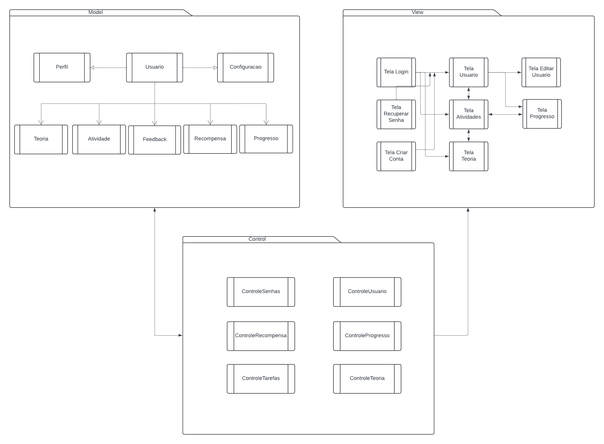
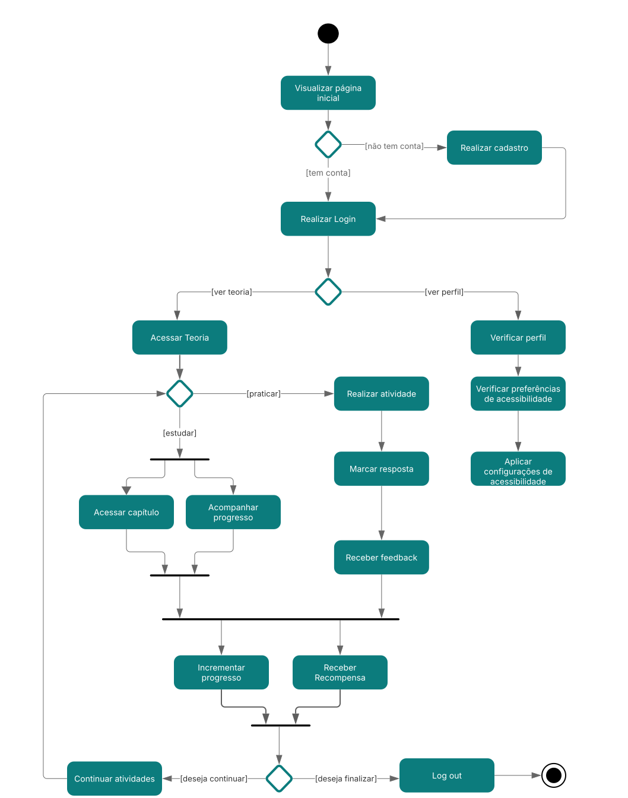
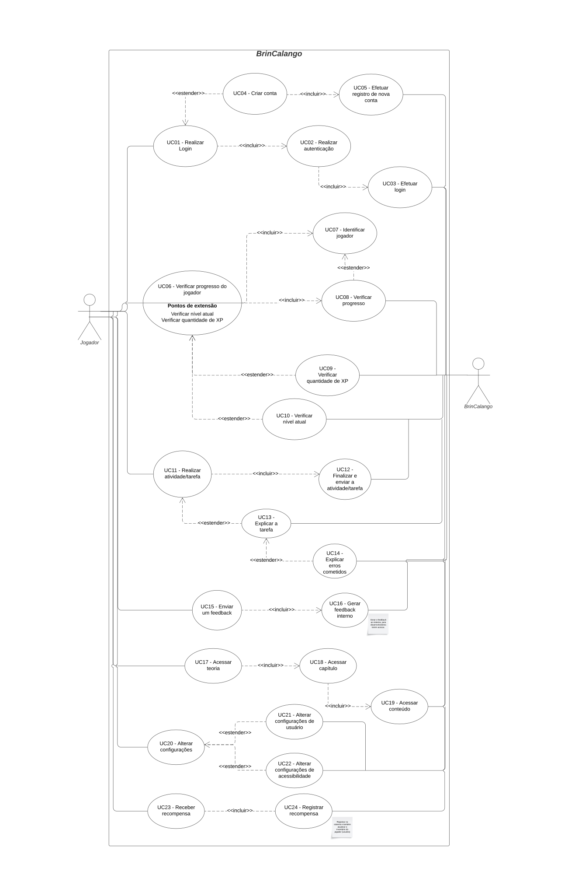

# BrinCalango

**Código da Disciplina**: FGA0208 
**Número do Grupo**: Projeto G1 - Jogo Educacional 
**Entrega**: 02 

## Alunos
| Matrícula   | Aluno                                         |
|-------------|-----------------------------------------------|
| 211041099   | Ana Catarina Lopes e Vasconcelos dos Santos   |
| 221007798   | Ana Julia Mendes Santos                       |
| 222037648   | André Cláudio Maia da Cunha                   |
| 222033952   | Cristiano Borges de Morais                    |
| 222006660   | Diogo Rodrigues Barboza                       |
| 221022355   | Júlia Rocha Fortunato                         |
| 221029249   | Júlia Takaki Neves                            |
| 202016720   | Luana Ribeiro Soares                          |
| 221008338   | Maria Clara Oleari de Araújo                  |
| 222007021   | Maurício Ferreira de Araújo                   |
| 211063256   | Victor Hugo Rodrigues Guimarães               |

## Sobre 
BrinCalango é uma aplicação web educacional que simula um jogo gamificado, voltado ao ensino da lógica de programação e da linguagem Calango, com foco na acessibilidade e inclusão do público infantojuvenil. Seu principal objetivo é despertar o interesse de crianças e adolescentes pela lógica de programação, por meio de atividades envolventes, intuitivas e lúdicas. Além disso, busca democratizar o acesso ao conhecimento tecnológico e apoiar o desenvolvimento de habilidades computacionais desde os primeiros anos da vida escolar.

O grande diferencial do BrinCalango está em seu compromisso com a acessibilidade digital. Na primeira versão do aplicativo, será buscado o atendimento ao maior número possível de critérios das diretrizes WCAG 2.2 e da norma brasileira NBR 17225, com a intenção de evoluir continuamente em futuras atualizações. O jogo será desenvolvido com linguagem simples e opções de configuração que permitam sua adaptação às necessidades de crianças com ou sem deficiência, promovendo uma experiência inclusiva e significativa para todos.

Para esta entrega, todos os diagramas sugeridos foram desenvolvidos com base no material disponibilizado no Moodle da disciplina e em fontes externas, como o site [uml-diagrams.org](https://www.uml-diagrams.org/).

## Screenshots da Segunda Entrega
### [Diagrama de Classes](https://unbarqdsw2025-1-turma02.github.io/2025.1-T02-_G1_JogoEducacional_Entrega_02/#/Modelagem/2.1.ModelagemEstatica?id=diagrama-de-classes)

### [Diagrama de Pacotes](https://unbarqdsw2025-1-turma02.github.io/2025.1-T02-_G1_JogoEducacional_Entrega_02/#/Modelagem/2.1.ModelagemEstatica?id=diagrama-de-pacotes)

### [Diagrama de Componentes](https://unbarqdsw2025-1-turma02.github.io/2025.1-T02-_G1_JogoEducacional_Entrega_02/#/Modelagem/2.1.ModelagemEstatica?id=diagrama-de-componentes)

### [Diagrama de Atividades](https://unbarqdsw2025-1-turma02.github.io/2025.1-T02-_G1_JogoEducacional_Entrega_02/#/Modelagem/2.2.ModelagemDinamica?id=diagrama-de-atividades)

### [Diagrama de Casos de Uso](http://localhost:3000/#/Modelagem/2.3.ModelagemOrganizacionalCasosDeUso?id=diagrama-de-casos-de-uso)

## Há algo a ser executado?

( ) SIM

(X) NÃO
